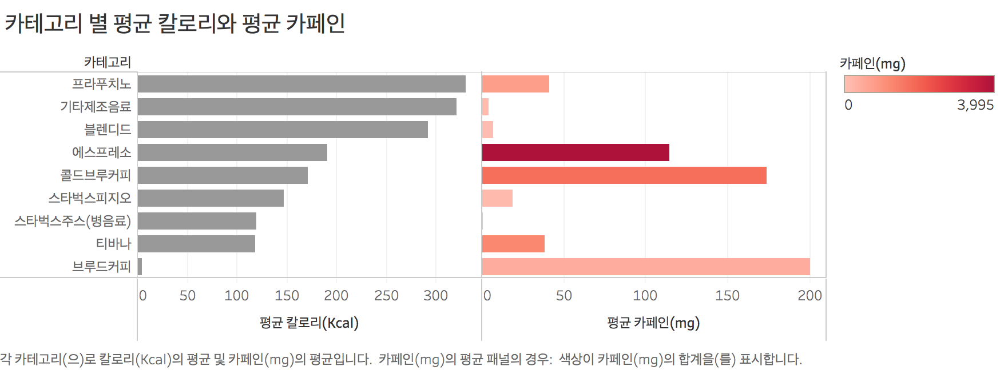
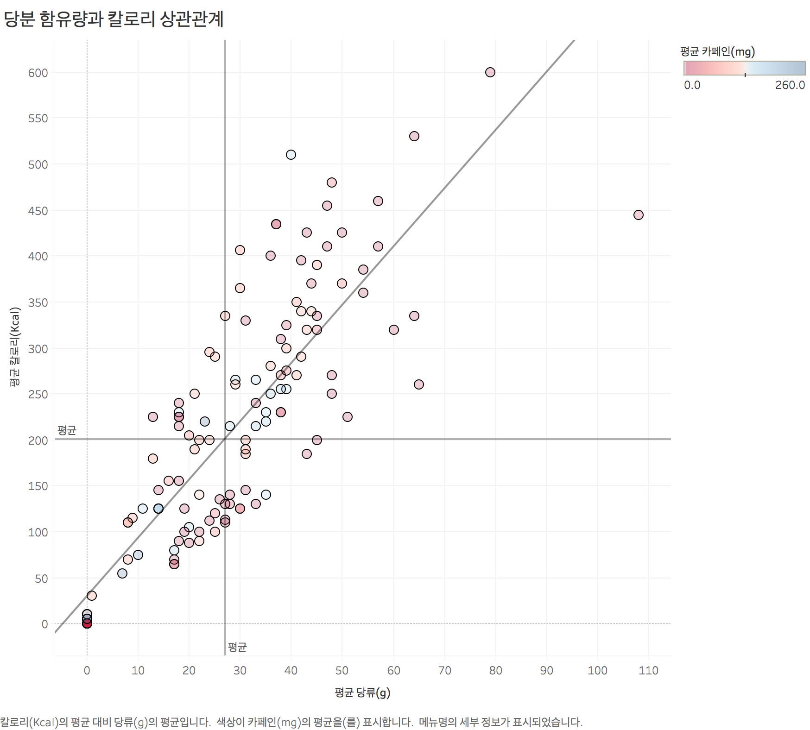
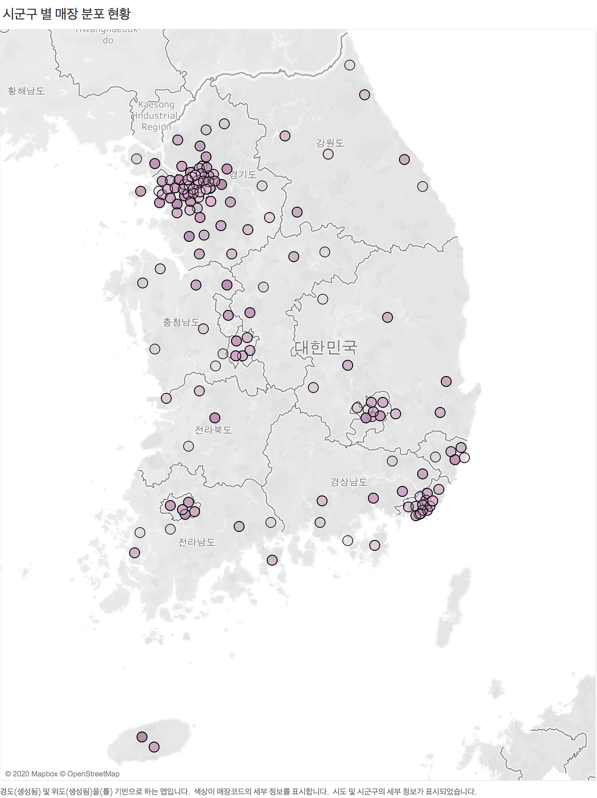
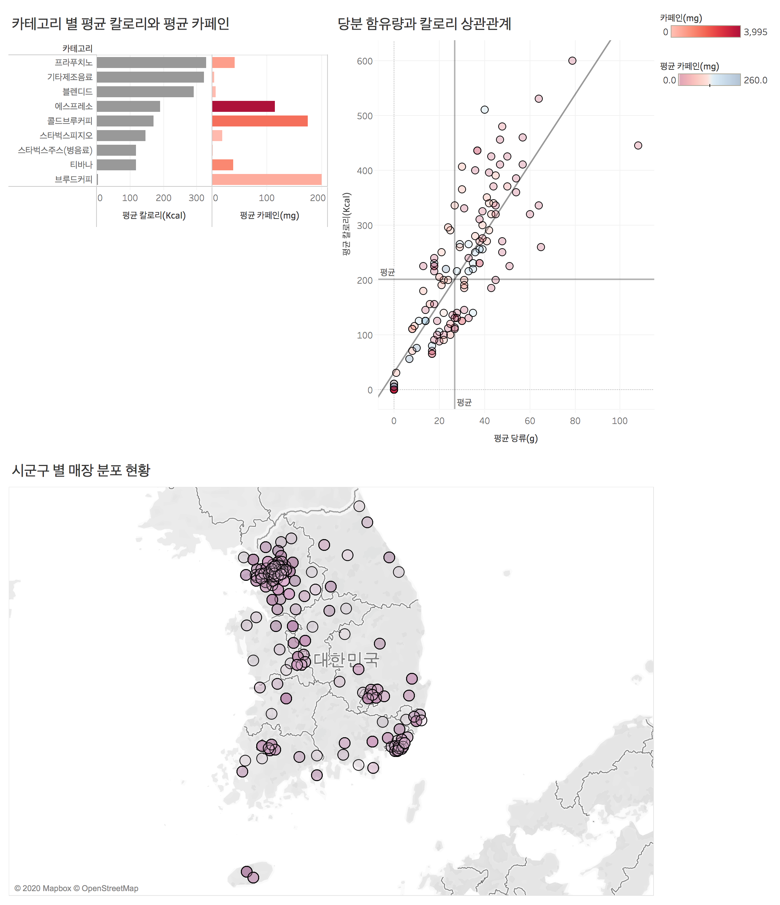
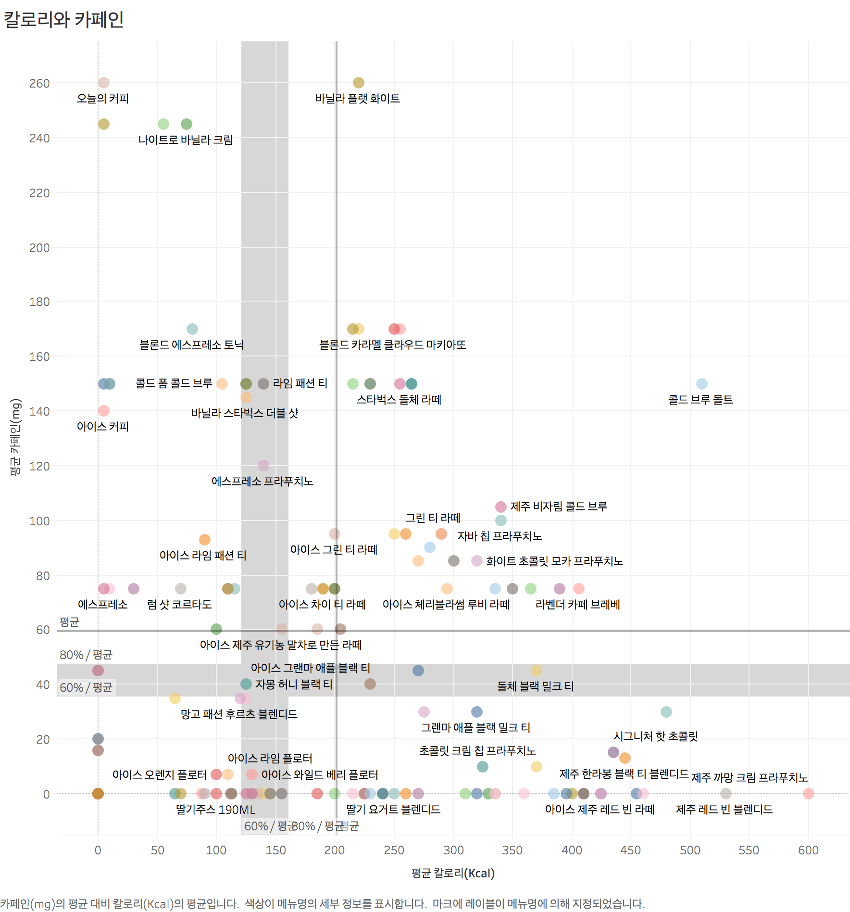
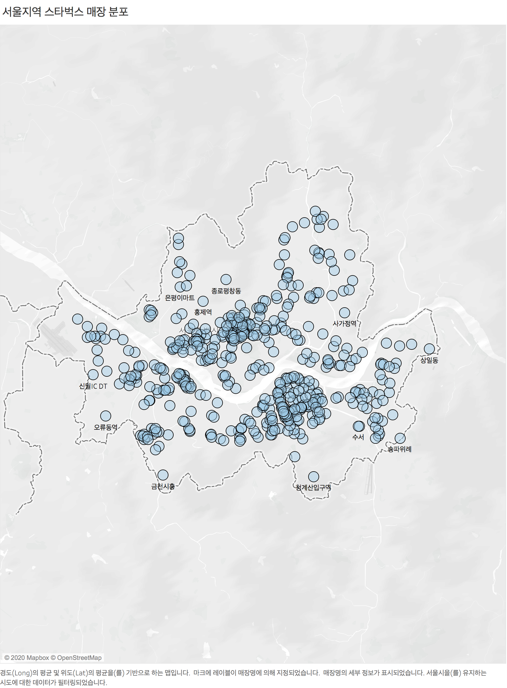

Tableau Day1
------

## Day1

### Goal
스타벅스 메뉴 데이터와 매장 정보 데이터를 이용해 시각화


### 가이드
태블로가 동작하는 원리
- 필드는 차원과 측정값으로 구분
  - 차원 : 측정값을 쪼개어 보는 관점
  - 측정값 : 숫자 형태로 집계가 되는 데이터 
- 측정값은 집계되어 표현

집계의 정의 
- 집계는 합계, 평균, 중앙값, 카운트, 카운트 (고유), 최소값, 최대값, 백분위수, 표준편차, 분산을 의미합니다. 

```
예를 들어, 지역별 매출 합계, 지역별 평균 매출, 제품 별 평균 할인율, 할인율 구간 별 고객 수 (카운트)와 같이 
하나의 측정값을 어떤 형태로 집계해서 보느냐에 따라 우리는 다양한 분석을 할 수 있습니다. 
```

측정값을 화면에 가져다 놓으면 기본적으로 합계 값으로 표현 
- 측정값을 합계 값이 아닌 평균 값으로 봐야 한다면, 집계 형태를 변경해줘야 합니다. 

집계의 형태를 변경해주는 방법
- 행 또는 열, 마크 선반에 놓여진 알약에서 마우스 오른쪽 버튼 클릭 후 측정값의 집계 형태를 변경
- 측정값을 가져올 때부터 집계 형태를 변경 
  - Windows : 측정값에서 마우스 오른쪽 버튼을 누른 상태로 드래그 
  - Mac : Option키 누른 상태로 드래그

- 알약을 행 선반에 놓으면 Y축에 표현, 열 선반에 놓았을 때 X축에 표현됩니다.  
- 마크 카드에 있는 마크의 형태, 색상, 크기, 레이블, 세부 정보, 도구 설명, (경로, 각도, 모양) 속성을 통해 원하는 형태로 다양한 시각화를 표현할 수 있습니다. 
- 필요한 값은 필터 카드를 통해 필터링 할 수 있습니다.
- 대시보드는 기존에 만들어 놓은 워크시트를 조합하여 만듭니다. 

### 과제 결과

카테고리 별 평균 칼로리와 평균 카페인




당분 함유량과 칼로리 상관관계




시군구 별 매장 분포 현황




1일차 대시보드




칼로리와 카페인




서울지역 스타벅스 매장 분포

