AWS 데이터 분석 특집 웨비나 - 데이터 웨어하우스(DW) 고도화를 위한 클라우드 기술과 이전 전략 
---

## 목차
- 데이터 웨어하우스 현대화
- 데이터 레이크 연동
- Redshift 아키텍처
- "Lake House" 고객 사례(미작성)
- Redshift 마이그레이션 방안(미작성)

## 1. 데이터 웨어하우스 현대화

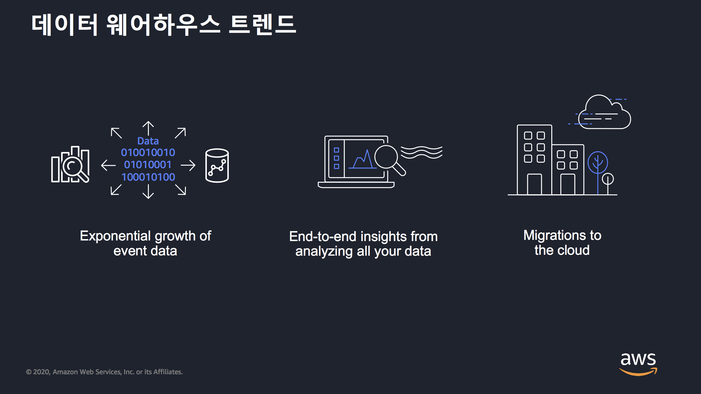

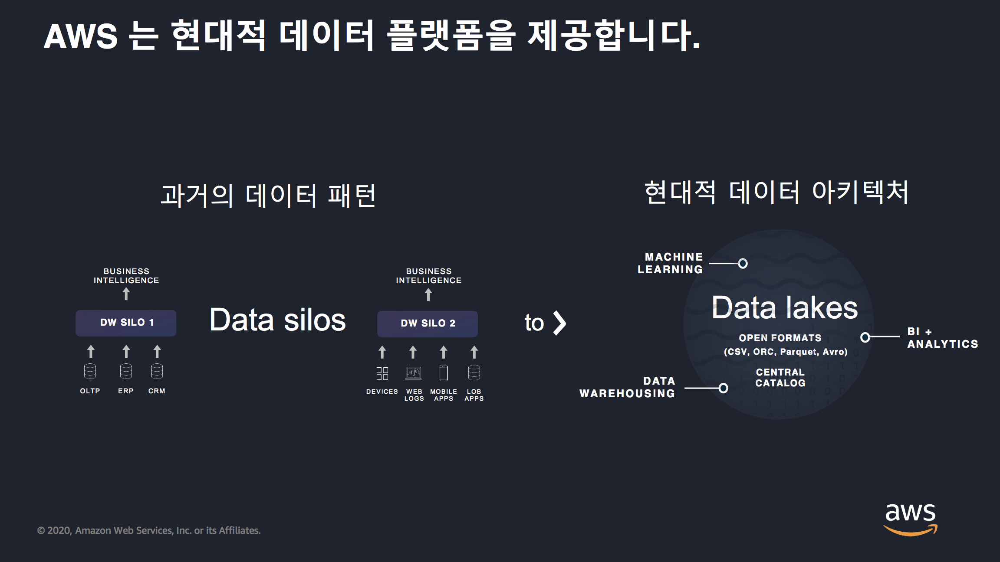

클라우드 데이터 웨어하우스 장점
- 전통적인 데이터는 비관계형 데이터 저장에 적합하지 않음
- 모든 데이터에 대해 single view 가 필요

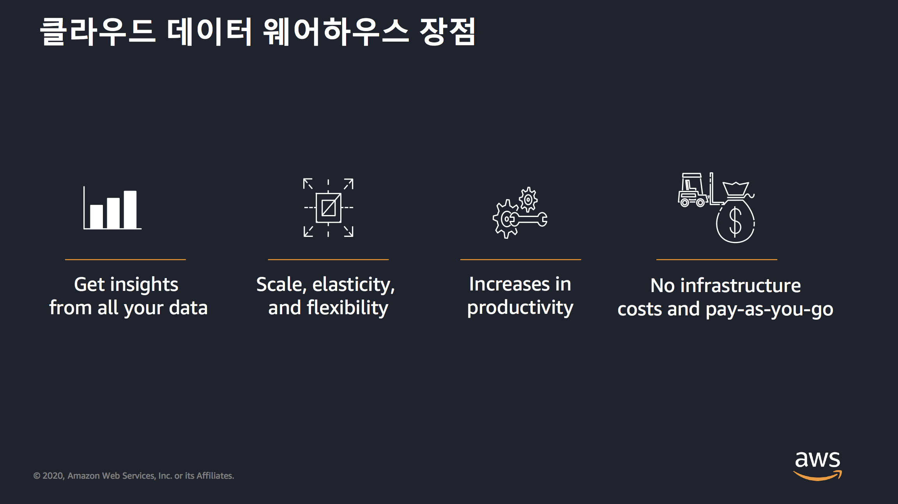

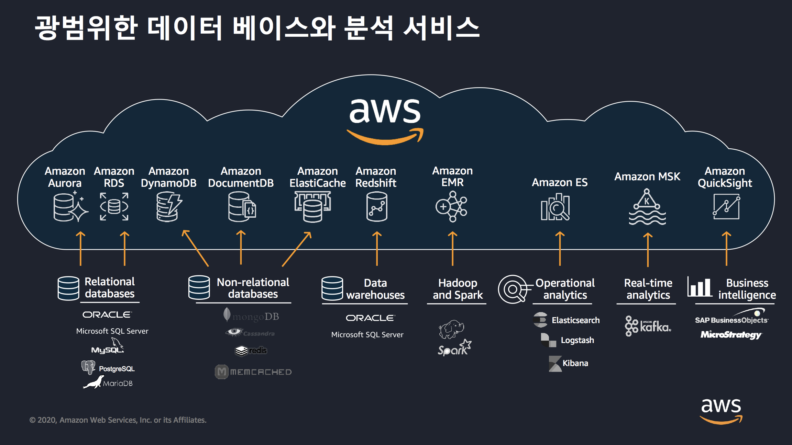

## 2. 데이터 레이크 연동

전형적인 Redshift 활용 방안
- 현대적 데이터 웨어 하우스, 사용 좋고 비용 적음
- 빠른 속도로 유입되는 대용량 스트리밍 서비스 생성
- 고성능 데이터 BI 생성 가능

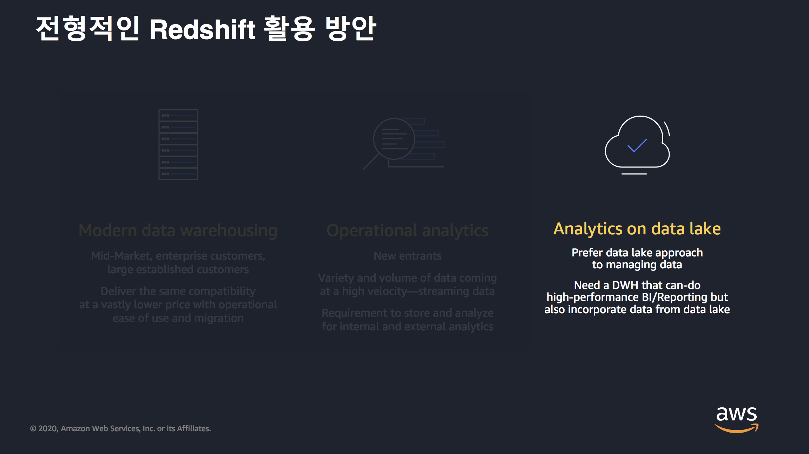

Redshift
- 정적인 데이터를 저장하고 PB 사이즈의 데이터 분석 가능
- 레드시프트는 데이터를 이동하지 않고 데이터 레이크에 쿼리를 확장 가능
- 다양한 타입의 포맷을 쿼리할 수 있다.
- 구조적이면서 자주 접근 할 수 있는 거는 Redshift에 저장해서 활용하면 좋음
- Glue는 Redshift로 ETL 가능

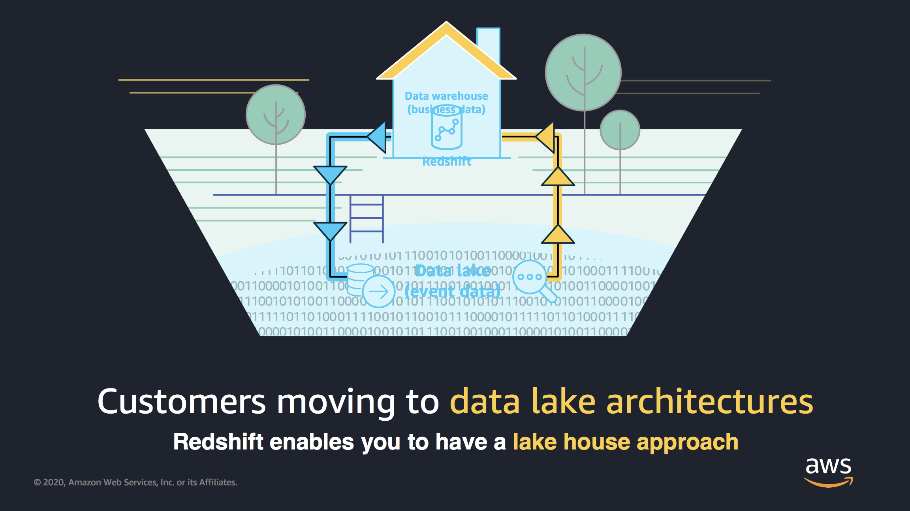

데이터 레이크와 데이터 웨어하우스 연동

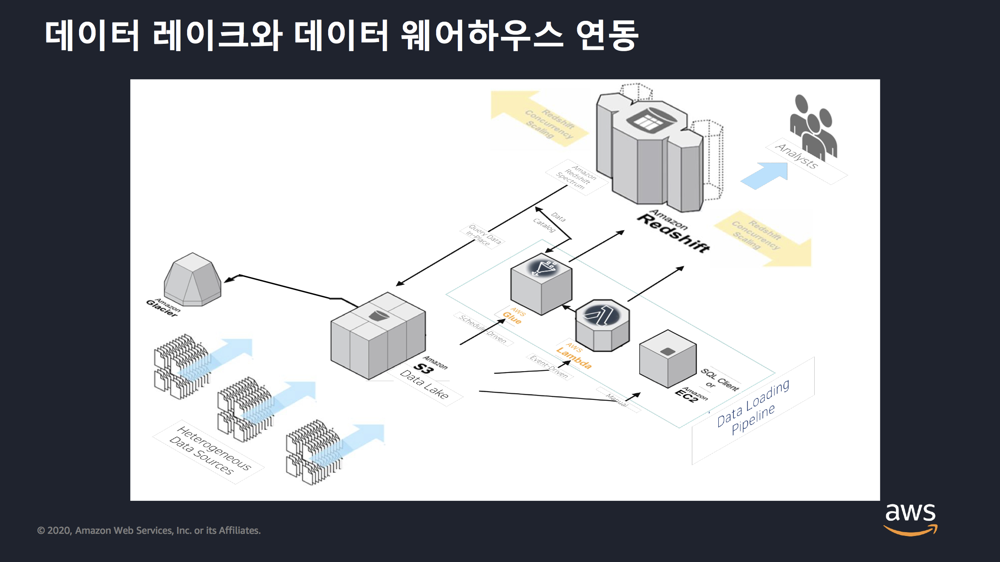

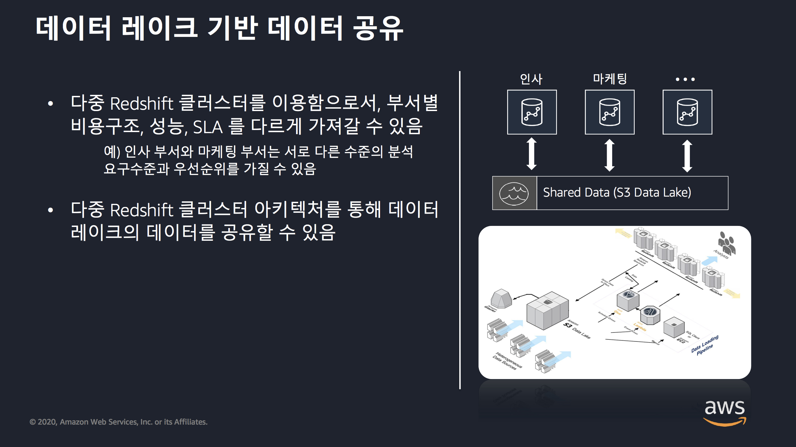

Redshift Spectrum을 통해 S3에 있는 데이터를 조회할 수 있음
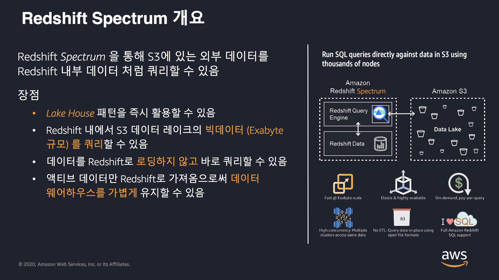

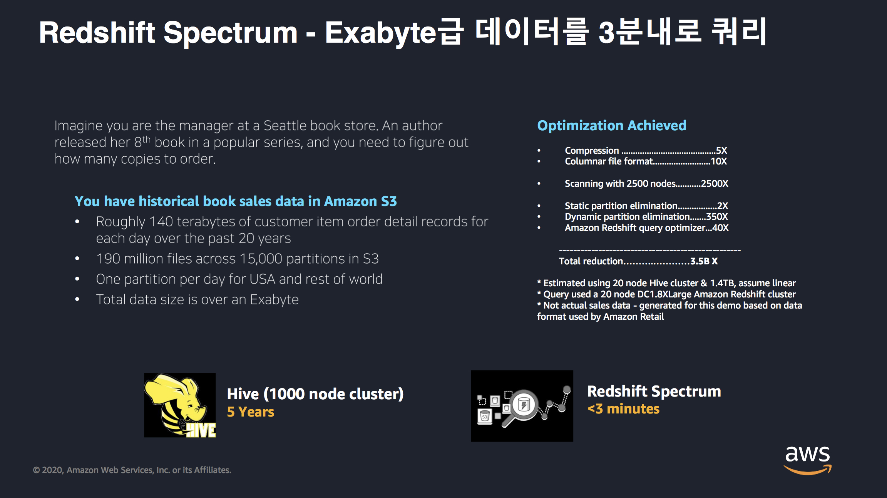

## 3. Redshift 아키텍처

Redshift는 column 기반의 데이터 웨어하우스

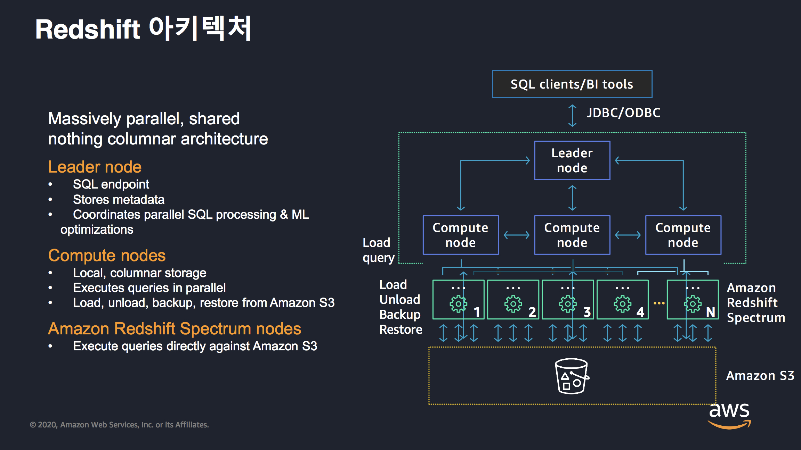

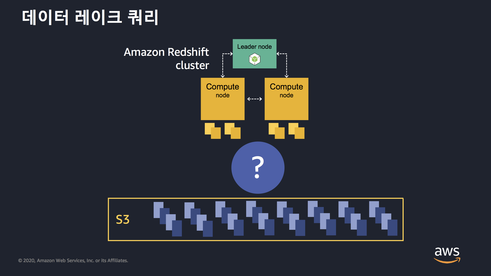

데이터 레이크 쿼리의 조건
- 많은 병렬 처리가 필요
- 읽어들이는 데이터의 양은 작아야 함
- 데이터 압축도 필요
- 전달되는 데이터 양이 적어야 하고 캐싱 필요

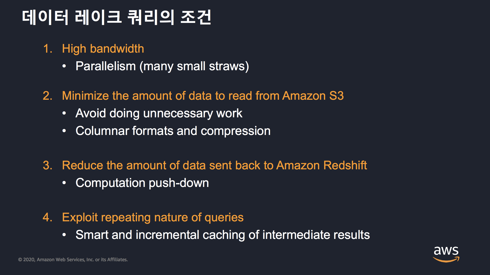

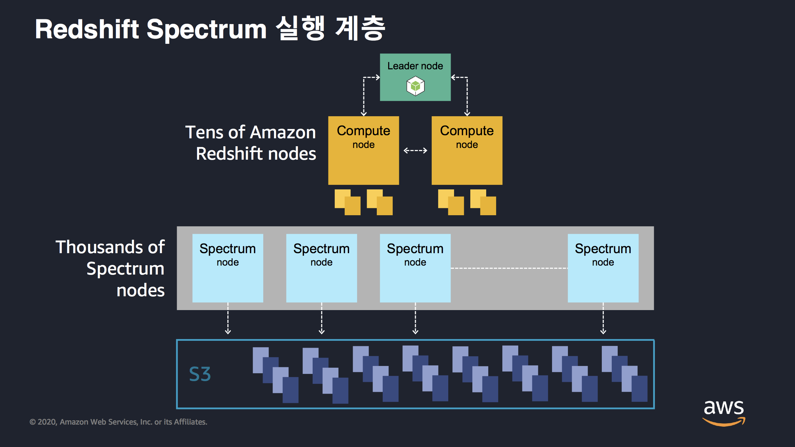

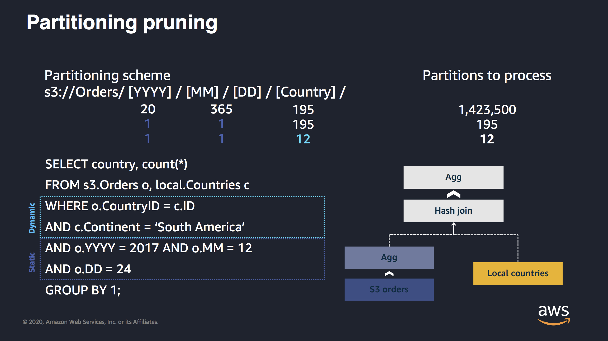

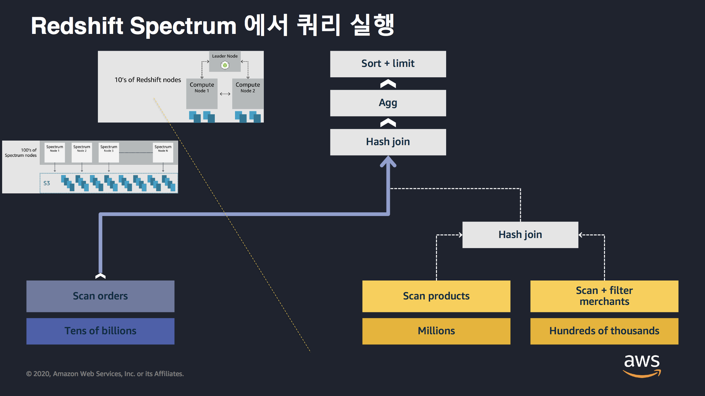

이 이후에는 이해를 하지 못해서 적지 않음