AWS 데이터 분석 특집 웨비나 - AWS 데이터레이크 환경에서의 데이터 분석 플랫폼 구축 사례
---

## 목차
- AWS Lakehouse
- SmartFactory 사례 공유
  - DataWareHouse 대시보드 분석
  - 실시간 분석 플랫폼
- Summary

## 1. AWS Lakehouse
Data Lake는 여러 소스의 데이터를 하나의 저장소에서 수집, 관리해주는 아키텍쳐
- 원본 데이터를 손쉽게 관리하면서, 빠르고 체계적으로 다른 데이터와 붙여서 분석 환경을 만들 수 있다.

## 2. SmartFactory 사례 공유
공정에서 발생하는 센서, 생산 데이터를 AWS 환경에서 수집, 분석, 모니터링

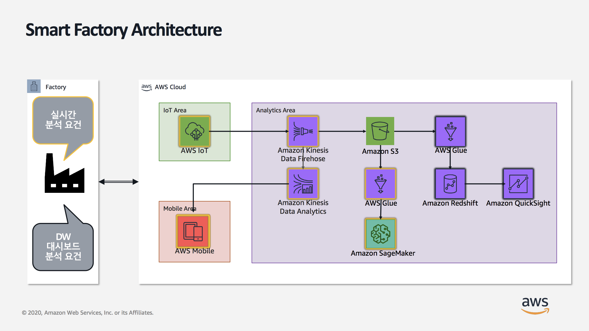

센서 데이터 수집
- 이상치 데이터 감지 하고 모바일로 전송

생산 데이터
- 이를 바탕으로 매출, 생산 보고서 BI 만들기

현재 공정의 장애 예측

크게 실시간과 배치로 작업을 나누어서 처리하였음

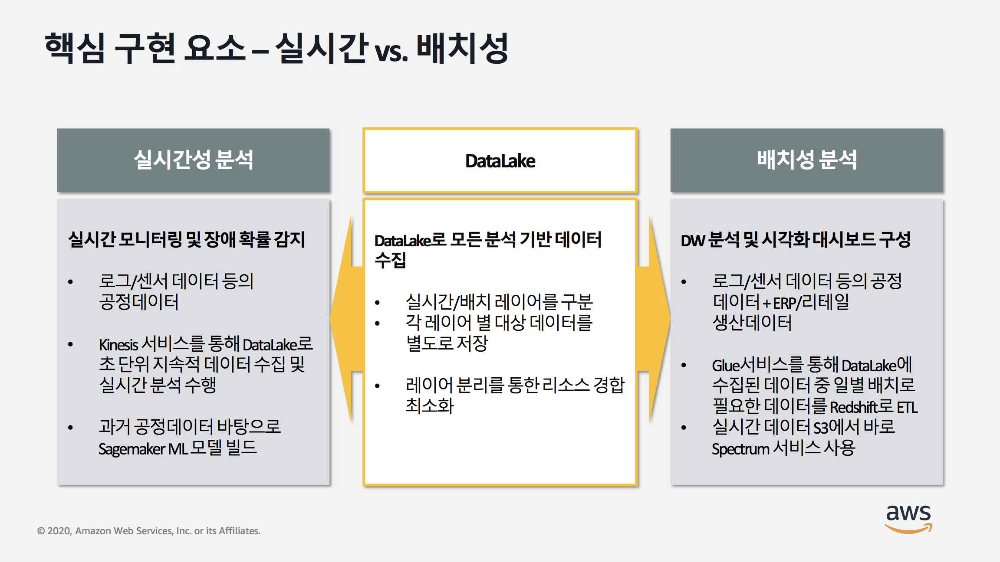

실시간 분석
- 현재 상태에 대해서 확률 분석
- 로그, 센서 데이터 분석 필요
- kinesis를 이용하여 수집과 분석을 동시에 진행

배치성 분석
- 필요한 데이터를 ETL 처리하고 Redshift로 보내서 처리하고 쿼리함

### DataWareHouse 대시보드 분석

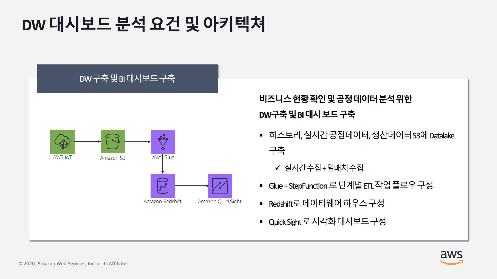

대부분의 데이터는 S3에 저장 되어 있음
- 전부다 Redshift로 보내는 게 아니라 최근 6개월만 보냈음
- 보내지 않은 것은 필요할 때 ad-hoc 방식으로 처리함

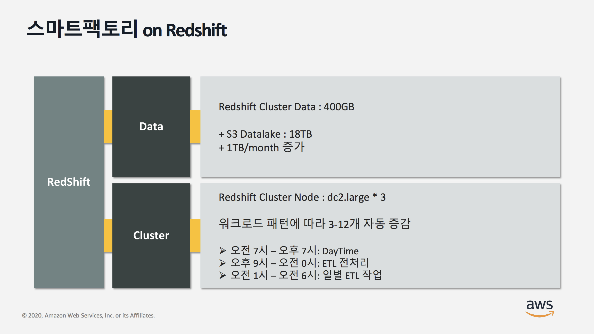

Glue를 이용하여 ETL 하였음
- Glue 내 Spark 이용

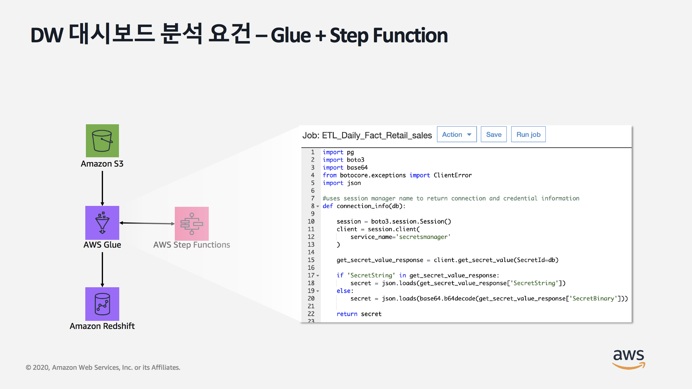

복잡한 ETL process를 step function을 이용하여 처리

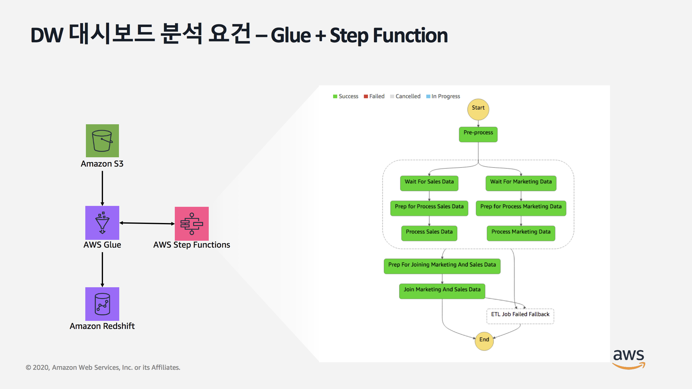

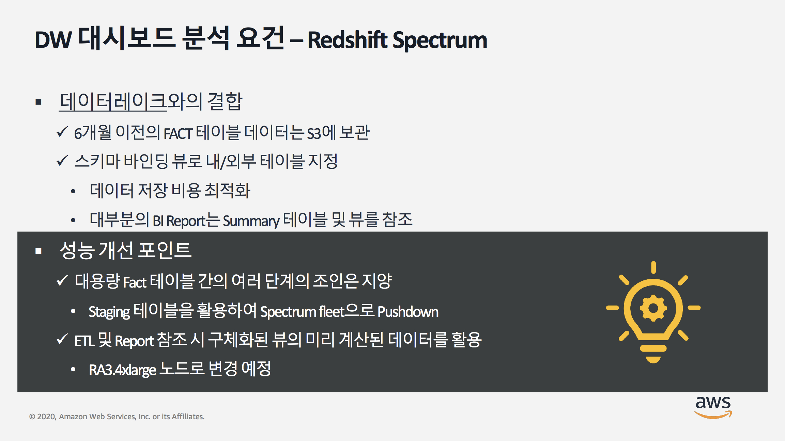

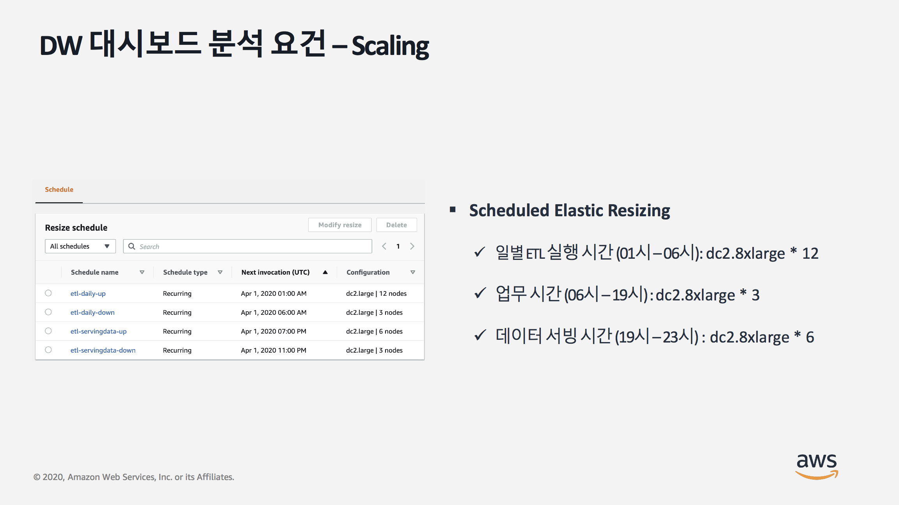

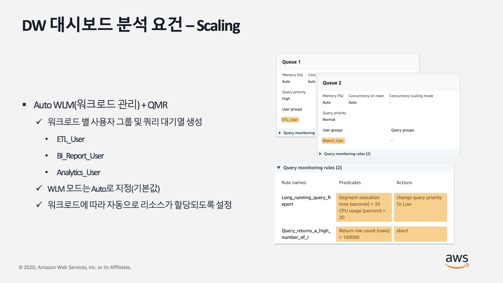
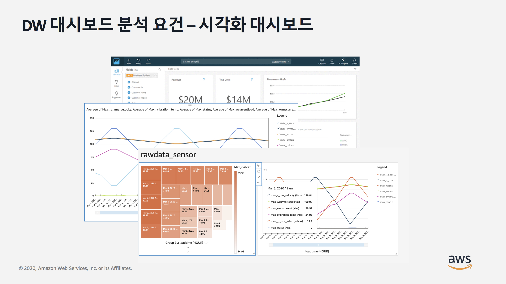
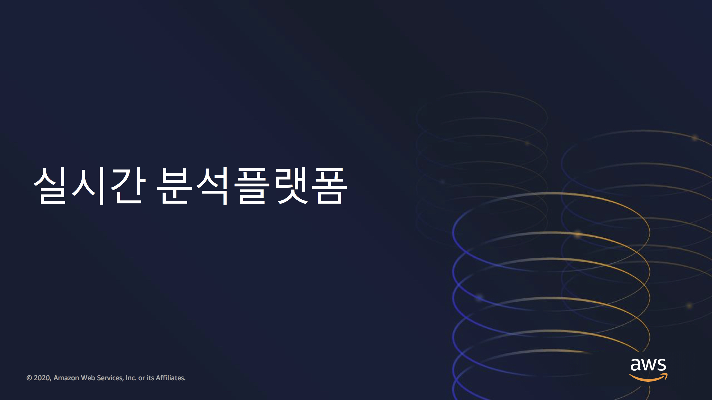
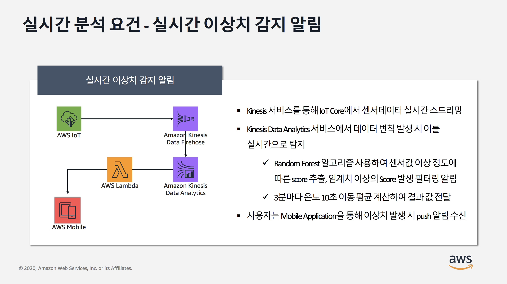

Sagemaker를 이용하여 분석

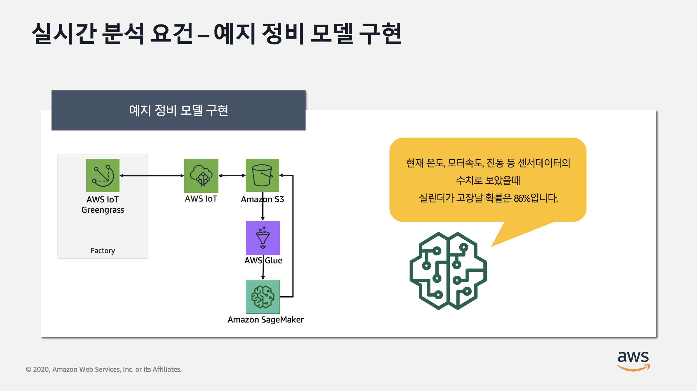

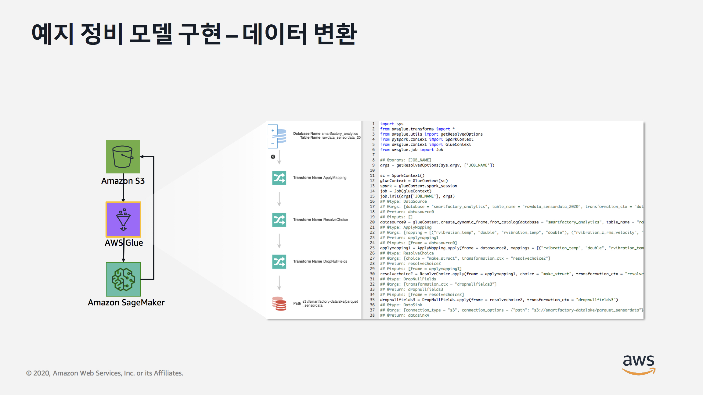

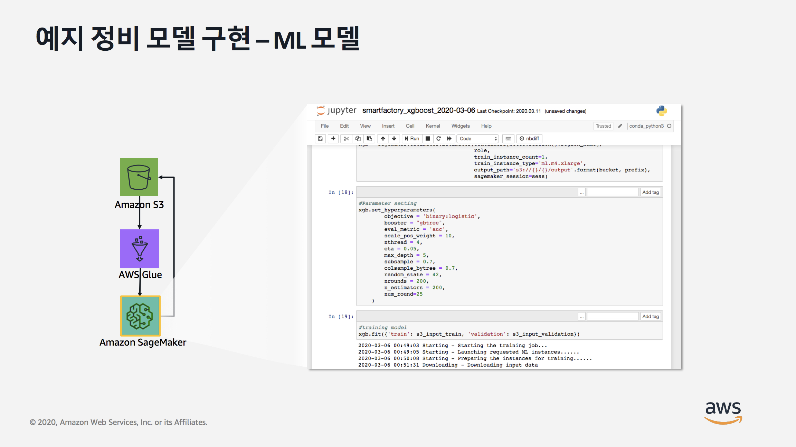

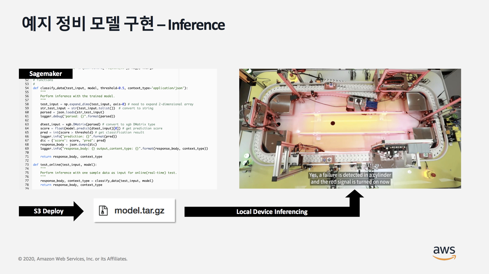

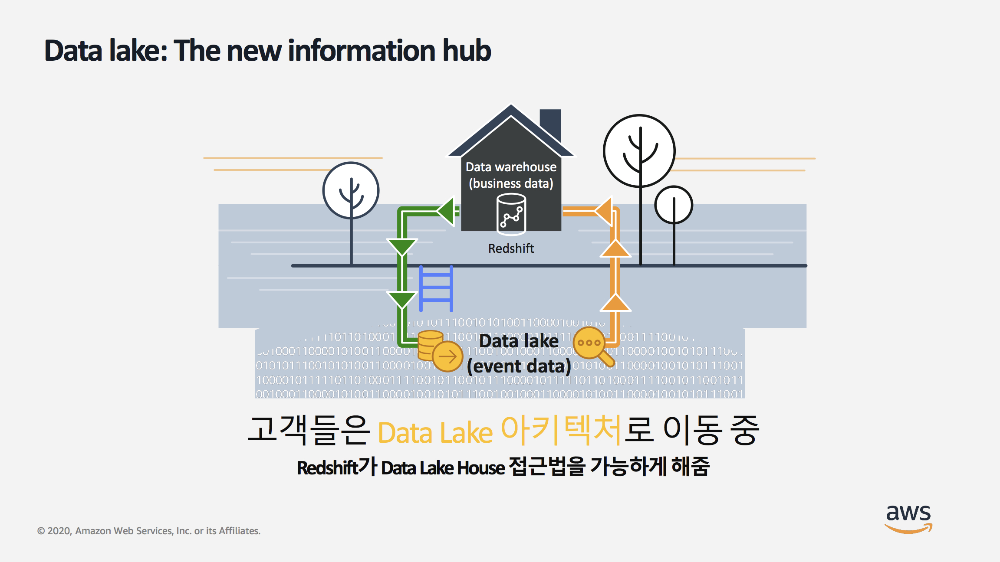

