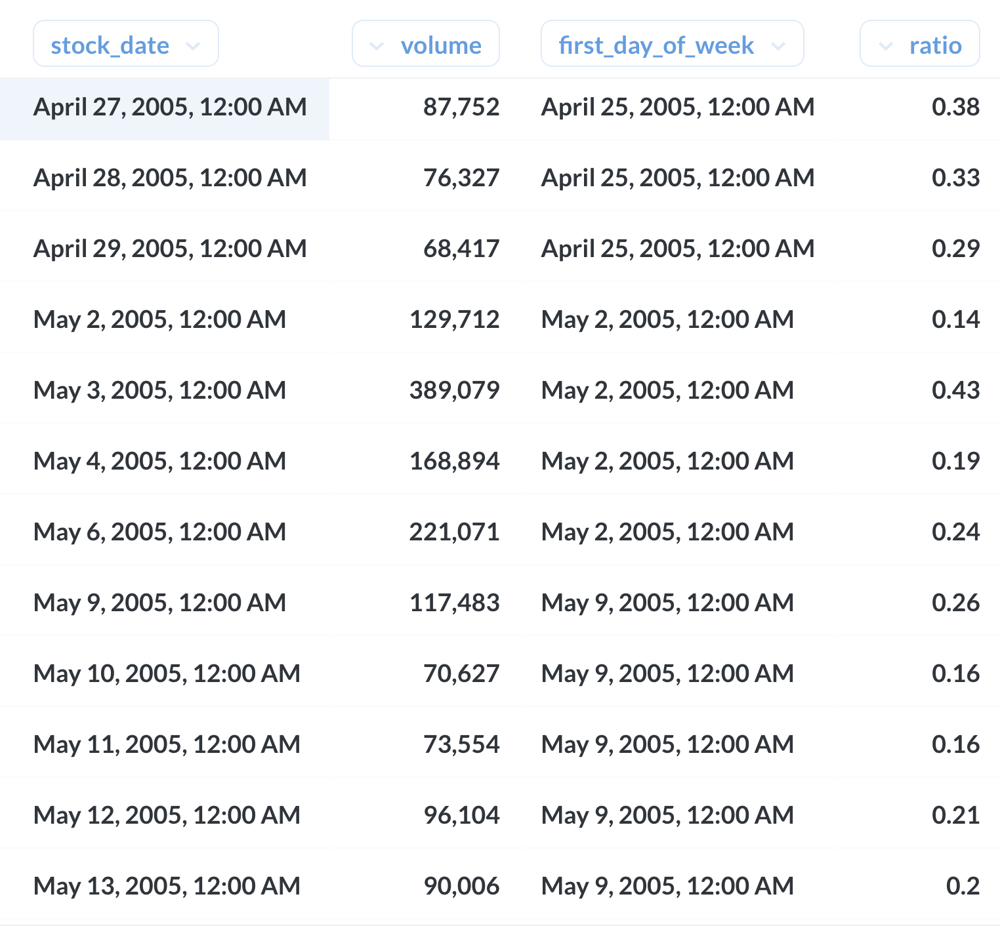

부분 비율 구하기
----

### 문서 목적
Window function을 이용하여 각 partition의 부분 비율을 구하는 쿼리

### 데이터
주식 데이터
- 주중(월-금) 거래 비율 -> 일별 거래량 / 주중 거래량의 총합

```sql
select
    stock_date,
    volume,
    DATE_ADD(stock_date, INTERVAL(-WEEKDAY(stock_date)) DAY) as first_day_of_week, -- 주의 첫째날을 구하는 쿼리
    volume / sum(volume) over (partition by DATE_ADD(stock_date, INTERVAL(-WEEKDAY(stock_date)) DAY)) as ratio
from stock_price
where Company = "Naver"

```




회사별 주중 거래 비율

```sql
select
    stock_date,
    volume,
    Company,
    DATE_ADD(stock_date, INTERVAL(-WEEKDAY(stock_date)) DAY) as first_day_of_week,
    volume / sum(volume) over (partition by Company, DATE_ADD(stock_date, INTERVAL(-WEEKDAY(stock_date)) DAY)) as ratio
from stock_price
where Company in ("Naver", "한국카본") and stock_date between "2005-04-25" and "2005-04-29"
```


