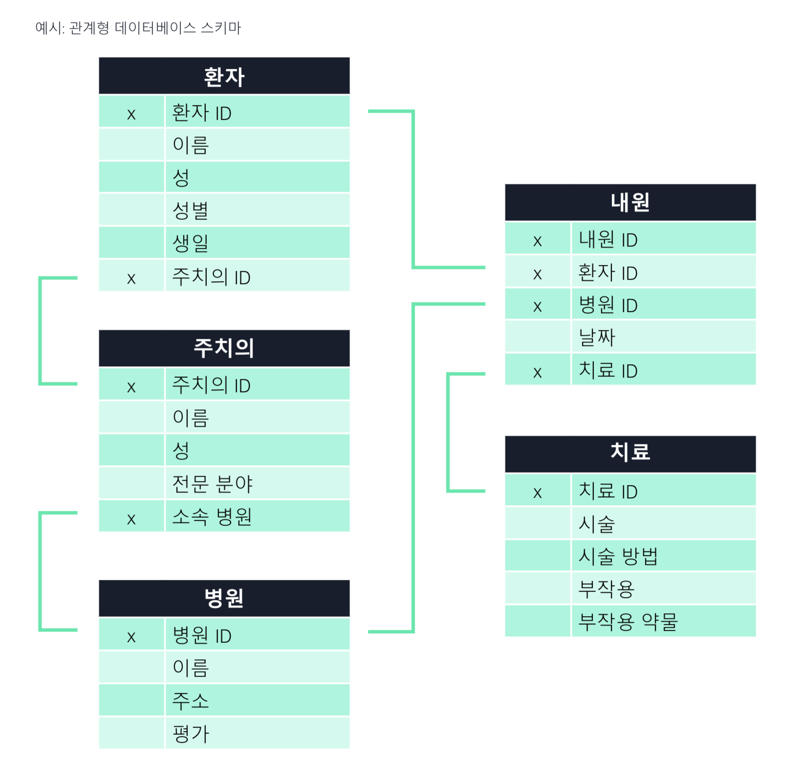

AWS e-book 정리
---

## 작업별로 적합한 데이터 베이스 유형 찾기

### 서론
관계형 데이터베이스는 일관적인 구조와 고정된 스키마로 이루어진 테이블형 데이터를 위해 설계됨
- 초기에 잘 정의된 문제에 대해 원활하게 작동
- ERP, CRM, 전자 상거래와 같은 기존 애플리케이션의 경우 트랜잭션을 로깅
- 여전히 필수적이고, 실제로도 그 수는 계속 증가하고 있다.
- 그러나 '관계형만을 활용'한 접근 방식은 더 이상 통하지 않음

### 간단히 살펴보기
여러 데이터베이스 유형에 관한 간략한 정보

**관계형**
- 높은 무결성, 정확성, 일관성, 무제한 인덱싱 제공
- ERP, CRM, 재무, 트랜잭션 및 데이터 웨어하우징에 유용함

**키-값**
- 규모와 무관하게 예측 가능한 짧은 지연 시간, 유연한 스키마, 선택적 일관성
- 실시간 입찰, 장바구니, 제품 카탈로그, 고객 선호도 및 지표, 메시지, 주문 이력과 같은 정렬 데이터 수집에 유용함

**문서**
- 유연성, 반구조화, 계층형, 애플리케이션 요구에따라변화,강력한인덱싱,빠른쿼리
- 카탈로그, 콘텐츠 관리 시스템, 사용자 프로필, 개인화 및 모바일에 유용함

**인메모리**
- 1밀리초 미만의 지연 시간, 초당 수백만 건의 작업, 간단한 명령 세트, 리치 명령 지원, 모든 유형의 데이터베이스에 적합함
- 캐싱, 세션 스토어, 리더보드, 지리 공간 및 실시간 분석에 유용함

**그래프**
- 고도로 연결된 데이터 세트 내에 관계를 생성하고 통과
- 사기 탐지, 소셜 네트워킹, 데이터 계보, 지식 그래프에 유용함

**시계열**
- 빠르게 축적되는 데이터에 대해 뛰어난 확장성
- DevOps, 애플리케이션 모니터링, 산업용 텔레메트리 및 IoT 애플리케이션에 유용함

**원장**
- 정확한 내역, 투명성, 불변성, 확인 가능성 및 뛰어난 확장성 보장
- 재무, 제조, 보험, HR 및 급여, 소매 및 공급망에 유용함

**와이드 컬럼**
- 대량의 데이터를 저장하는 워크로드에 대해 유연성과 확장성 제공
- 사용자, 디바이스 및 이벤트 관련 정보 저장에 유용함(예: 사용자 프로파일, IoT 디바이스 데이터 및 메시징 앱의 로그 파일이나 채팅 이력 같은 시계열 데이터)

### 관계형 데이터 베이스
기본 개요
- RDBMS(관계형 데이터베이스 관리 시스템)에서 데이터는 열과 행의 테이블 형식으로 저장
- 데이터는 SQL(구조화된 쿼리 언어)을 사용하여 쿼리됨
- 테이블의 각 열은 특성을 나타내고, 각 행은 레코드를 나타내며, **각 필드**는 데이터 값을 나타냄
- 관계형 데이터베이스가 많이 사용되는 것은 SQL이 학습하기 쉽고 사용하는데 기본 스키마를 알 필요가 없다는 점
- 전체 본문을 지정하지 않고 데이터베이스 항목을 수정할 수 있기 때문

장점
- 구조화된 데이터에 적합함
- ACID 트랜잭션 일관성 및 '조인' 지원
- 데이터 무결성 기본 제공
- 데이터 정확성 및 일관성 보장
- 시스템의 관계 제약
- 무제한 인덱싱 가능

설계 의도와 맞지 않는 것
- 반구조화 또는 희소 데이터

사용 사례
- ERP 앱, CRM, 재무, 트랜잭션, 데이터 웨어하우징

### 용어 정리
- 온프레미스(on-premise) : 기업의 서버를 클라우드 같은 원격 환경에서 운영하는 방식이 아닌, 자체적으로 보유한 전산실 서버에
직접 설치해서 사용하는 방식
  - 클라우드 컴퓨팅이 나오기 전에는 일반적인 기업 구축 방식
  - 장점은 보안성이 높다는 것, 단점은 시스템을 구축하는 데 오래 걸린다는 것
  - 반대말은 클라우드 서비스
- 트랜잭션 : 트랜잭션(Transaction)은 데이터베이스의 상태를 변환시키는 하나의 논리적 기능을 수행하기 위한 작업의 단위 또는 한꺼번에 모두 수행되어야 할 일련의 연산들을 의미한다.
  - 트랜잭션은 데이터베이스 시스템에서 병행 제어 및 회복 작업 시 처리되는 작업의 논리적 단위이다.
  - 사용자가 시스템에 대한 서비스 요구 시 시스템이 응답하기 위한 상태 변환 과정의 작업단위이다.
  - 하나의 트랜잭션은 Commit되거나 Rollback된다.
  - 출처 : https://coding-factory.tistory.com/226
- ACID : ACID(원자성, 일관성, 고립성, 지속성)는 데이터베이스 트랜잭션이 안전하게 수행된다는 것을 보장하기 위한 성질을 가리키는 약어
  - https://ko.wikipedia.org/wiki/ACID
  - **원자성(Atomicity)**은 트랜잭션과 관련된 작업들이 부분적으로 실행되다가 중단되지 않는 것을 보장하는 능력이다. 예를 들어, 자금 이체는 성공할 수도 실패할 수도 있지만 보내는 쪽에서 돈을 빼 오는 작업만 성공하고 받는 쪽에 돈을 넣는 작업을 실패해서는 안된다. 원자성은 이와 같이 중간 단계까지 실행되고 실패하는 일이 없도록 하는 것이다.
  - **일관성(Consistency)**은 트랜잭션이 실행을 성공적으로 완료하면 언제나 일관성 있는 데이터베이스 상태로 유지하는 것을 의미한다. 무결성 제약이 모든 계좌는 잔고가 있어야 한다면 이를 위반하는 트랜잭션은 중단된다.
  - **독립성(Isolation)**은 트랜잭션을 수행 시 다른 트랜잭션의 연산 작업이 끼어들지 못하도록 보장하는 것을 의미한다. 이것은 트랜잭션 밖에 있는 어떤 연산도 중간 단계의 데이터를 볼 수 없음을 의미한다. 은행 관리자는 이체 작업을 하는 도중에 쿼리를 실행하더라도 특정 계좌간 이체하는 양 쪽을 볼 수 없다. 공식적으로 고립성은 트랜잭션 실행내역은 연속적이어야 함을 의미한다. 성능관련 이유로 인해 이 특성은 가장 유연성 있는 제약 조건이다. 자세한 내용은 관련 문서를 참조해야 한다.
  - **지속성(Durability)**은 성공적으로 수행된 트랜잭션은 영원히 반영되어야 함을 의미한다. 시스템 문제, DB 일관성 체크 등을 하더라도 유지되어야 함을 의미한다. 전형적으로 모든 트랜잭션은 로그로 남고 시스템 장애 발생 전 상태로 되돌릴 수 있다. 트랜잭션은 로그에 모든 것이 저장된 후에만 commit 상태로 간주될 수 있다.