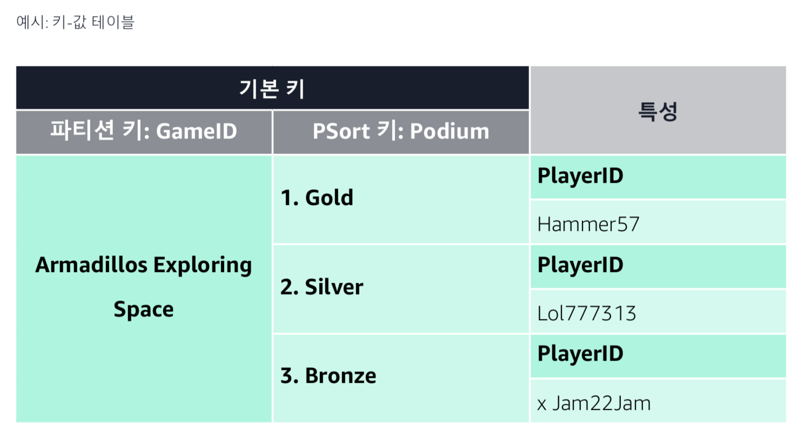

AWS e-book 정리
---

## 작업별로 적합한 데이터 베이스 유형 찾기

### 서론
관계형 데이터베이스는 일관적인 구조와 고정된 스키마로 이루어진 테이블형 데이터를 위해 설계됨
- 초기에 잘 정의된 문제에 대해 원활하게 작동
- ERP, CRM, 전자 상거래와 같은 기존 애플리케이션의 경우 트랜잭션을 로깅
- 여전히 필수적이고, 실제로도 그 수는 계속 증가하고 있다.
- 그러나 '관계형만을 활용'한 접근 방식은 더 이상 통하지 않음

### 간단히 살펴보기
여러 데이터베이스 유형에 관한 간략한 정보

**관계형**
- 높은 무결성, 정확성, 일관성, 무제한 인덱싱 제공
- ERP, CRM, 재무, 트랜잭션 및 데이터 웨어하우징에 유용함

**키-값**
- 규모와 무관하게 예측 가능한 짧은 지연 시간, 유연한 스키마, 선택적 일관성
- 실시간 입찰, 장바구니, 제품 카탈로그, 고객 선호도 및 지표, 메시지, 주문 이력과 같은 정렬 데이터 수집에 유용함

**문서**
- 유연성, 반구조화, 계층형, 애플리케이션 요구에따라변화,강력한인덱싱,빠른쿼리
- 카탈로그, 콘텐츠 관리 시스템, 사용자 프로필, 개인화 및 모바일에 유용함

**인메모리**
- 1밀리초 미만의 지연 시간, 초당 수백만 건의 작업, 간단한 명령 세트, 리치 명령 지원, 모든 유형의 데이터베이스에 적합함
- 캐싱, 세션 스토어, 리더보드, 지리 공간 및 실시간 분석에 유용함

**그래프**
- 고도로 연결된 데이터 세트 내에 관계를 생성하고 통과
- 사기 탐지, 소셜 네트워킹, 데이터 계보, 지식 그래프에 유용함

**시계열**
- 빠르게 축적되는 데이터에 대해 뛰어난 확장성
- DevOps, 애플리케이션 모니터링, 산업용 텔레메트리 및 IoT 애플리케이션에 유용함

### 관계형 데이터 베이스
기본 개요
- RDBMS(관계형 데이터베이스 관리 시스템)에서 데이터는 열과 행의 테이블 형식으로 저장
- 데이터는 SQL(구조화된 쿼리 언어)을 사용하여 쿼리됨
- 테이블의 각 열은 특성을 나타내고, 각 행은 레코드를 나타내며, **각 필드**는 데이터 값을 나타냄
- 관계형 데이터베이스가 많이 사용되는 것은 SQL이 학습하기 쉽고 사용하는데 기본 스키마를 알 필요가 없다는 점
- 전체 본문을 지정하지 않고 데이터베이스 항목을 수정할 수 있기 때문

장점
- 구조화된 데이터에 적합함
- ACID 트랜잭션 일관성 및 '조인' 지원
- 데이터 무결성 기본 제공
- 데이터 정확성 및 일관성 보장
- 시스템의 관계 제약
- 무제한 인덱싱 가능

설계 의도와 맞지 않는 것
- 반구조화 또는 희소 데이터

사용 사례
- ERP 앱, CRM, 재무, 트랜잭션, 데이터 웨어하우징

AWS Service
- Amazon Aurora : 클라우드용으로 구축된 MySQL 및 PostgreSQL 호환 관계형 데이터베이스
- Amazon Relational Database Service(RDS): 클라우드에서 관계형 데이터베이스를 손쉽게 설치, 운영 및 확장할 수 있는 서비스. 
비용 효율적이고 크기 조정이 가능한 용량을 제공하면서 시간이 많이 소요되는 관리 작업을 자동화
  - Amazon Aurora, PostgreSQL, MySQL, MariaDB, Oracle Database 및 SQL Server와 같은 7가지 익숙한 데이터베이스 엔진을 제공
- Amazon Redshift: 로딩 없이 데이터 웨어하우스 쿼리를 데이터 레이크로 확장하는 클라우드 데이터 웨어하우스. 로컬 방식으로 저장된 페타바이트 단위의 데이터 및 Amazon S3에 저장된 엑사바이트 단위의 데이터에 대해 직접 분석 쿼리를 실행


### 키-값(key-value) 데이터베이스
기본 개요
- key-value 데이터베이스는 데이터를 key-value 쌍의 컬렉션으로 저장
- 하나 이상의 키가 인덱스에 대한 고유한 식별자 역할을 함
- 스키마는 인덱싱되지 않는 쌍에 대해 유연하며, 희소할 수 있다.
- value는 단순한 수부터 복잡한 문자열 또는 완전한 JSON 문서에 이르기까지 다양할 수 있다.
- key-value store는 샤딩된 수평 규모 조정에 제공되므로 단일 노드의 수직 규모 조정 제약과 무관하게 일관적인 읽기 및 쓰기 작업 가능
- 액세스 패턴이 알려져 있고 완전히 인덱싱된 작업 요건의 경우 key-value 데이터베이스에서 규모와 무관하게 일관적으로 짧은 지연 시간을 제공 가능

장점
- 규모 저징이 단일 노드의 CPU 부하와 분리되어 처리량 요건과 무관하게 일관적으로 짧은 지연 시간
- 스키마 유연성으로 인해 희소 스토리지 및 직접 개발자 소유 허
 
설계 의도와 맞지 않음
- 애드혹 또는 분석 액세스 패턴
- 동기식 집계 또는 참조 무결성

사용 사례
- 실시간 입찰, 장바구니, 제품 카탈로그, 고객 선호, IoT 데이터 수집, 정렬식 명령 또는 활동 내역

AWS Service
- Amazon DynamoDB: 규모에 관계없이 10밀리초 미만의 성능을 제공하는 완전 관리형(서버리스) 키–값 데이터베이스. 기본 제공 보안, 최종적이며 강력한 읽기 일관성, 하나 이상의 행에 걸친 트랜잭션 작업에 대한 ACID 준수, 백업 및 복원, 인메모리 캐싱이 가능한 다중 리전, 다중 마스터 데이터베이스입니다. 
가장 높은 수준의 가용성과 규모 조정 탄력성을 제공



### Document(문서) 데이터베이스
기본 개요
- Document(문서) 데이터베이스의 데이터는 JSON 과 유사한 문서에 저장되고, JSON 문서는 데이터베이스 내에서 가장 중요한 객체
- 이 방식은 개발자가 애플리케이션 코드에서 사용하는 것과 동일한 Doc - model 형식을 사용하여 데이터를 더 쉽게 저장 및 쿼리할 수 있다.

장점
- 유연성, 반구조화 및 계층형
- 데이터베이스의 변화에 따라 애플리케이션 요구 사항 조정 가능
- 유연한 스키마 
- 간단한 계층형 및 반구조화 데이터
- 빠른 쿼리에 적합한 강력한 인덱스
- 객체 지향 프로그래밍에 문서를 매핑
- 영구 계층으로 데이터가 쉽게 흐름
- 문서용으로 구축된 표현 쿼리 언어(?)
- 애드혹 쿼리 및 문서 간 집계 가능

설계 의도와 맞지 않음
- 데이터 사이에 명시적으로 정의된 관계

사용 사례
- 카탈로그, 콘텐츠 관리 시스템, 사용자 프로필/개인화, 모바일

AWS Service
- Amazon DocumentDB: MongoDB 워크로드를 지원하는 완전 관리형 문서 데이터베이스 서비스로, 탁월한 속도, 확장성 및 고가용성을 제공합니다. 처음부터 미션 크리티컬 성능, 확장성 및 가용성을 위해 설계


### 인메모리 데이터베이스
기본 개요
- 실시간 애플리케이션 사용과 함께 떠오름
- 데이터 저장, 관리 및 조작에 있어 주로 기본 메모리를 활용
- 메모리 캐싱을 위해 오픈 소스 소프트웨어에서 인메모리 많이 사용
- 데이터 캐싱을 통해 동적 데이터베이스의 속도를 높여 액세스 지연 시간을 줄이고, 처리량을 늘리고, 데이터베이스의 부하를 줄일 수 있음

장점
- 1밀리초 미만의 지연 시간
- 초당 수백만 건의 작업 수행 가능
- 디스크 기반에 비해 높은 성능 이점
- 더욱 간단한 명령 세트
- 리치 명령 세트 지원(redis)
- 모든 유형의 데이터베이스, 관계형 또는 비관계형은 물론 스토리지 서비스에도 사용 가능

설계 의도와 맞지 않음
- 항상 디스크에 데이터를 영구 보관

사용 사례
- 캐싱, 세션 스토어, 리더보드, 지리 공간 서비스, 게시/구독, 실시간 스트리

AWS Service
- Amazon ElastiCache for Redis: Redis와 호환되는 매우 빠른 완전 관리형 인메모리 데이터 스토어입니다. 1밀리초 미만의 지연 시간을 제공하며 인터넷 규모의 실시간 애플리케이션을 가동합니다.
- Amazon ElastiCache for Memcached: Memcached와 호환되는 완전 관리형 인메모리 키-값 스토어 서비스입니다. 캐시 또는 데이터 스토어로 사용할 수 있습니다. Memcached의 성능, 사용 편의성 및 단순성을 제공합니다.


### 그래프 데이터베이스
기본 개요
- NOSQL
- 관계가 가장 중요
- SPARQL, Gremlin과 같은 특화된 그래프 언어 사용
- 데이터는 노드, 엣지 및 속성의 형태로 저장
  - 노드는 관계형 데이터베이스 시스템의 레코드와 동일
  - 엣지는 노드를 연결하는 관계를 나타냄
  - 속성은 노드에 추가된 추가 정보
  - RDF 그래프에서 노드, 엣지 및 속성의 개념은 IRI(Internationalized Resource Identifier) 가 포함된 리소스로 표현됩니다.
    
장점
- 주기적 스키마 변경 가능
- 여러 유형의 데이터 간 관계를 빠르게 생성
- 실시간 쿼리 응답 시간
- 규모와 무관하게 관련 있는 데이터 쿼리에 있어 최상 성능
- 유연한 온라인 스키마

설계 의도와 맞지 않음
- 관계를 통과 또는 쿼리하지 않는 경우
- 많은 양의 트랜잭션 처리
- 전체 데이터베이스에 걸친 쿼리 처리

사용 사례
- 사기 탐지, 소셜 네트워킹, 추천 엔진, 지식 그래프, 데이터 계보

AWS Service
- Amazon Neptune: 빠르고 안정적인 완전 관리형 그래프 데이터베이스 서비스로, 상호 연결성이 높은 데이터 세트를 활용하는 애플리케이션을 쉽게 구축하고 실행할 수 있습니다.


### 시계열 데이터베이스
기본 개요
- 타임스탬프 또는 시계열 데이터에 최적화 되어 있음
- 일반적으로 시간 순서 형태로 제공
- 데이터는 추가만 가능하고 쿼리는 항상 시간 간격을 두고 이루어짐
- 서버 지표, 애플리케이션 성능 모너티렁 등이 있음

장점
- 시간에 따라 추적, 모니터링 집계되는 측정 이벤트에 적합
- 데이터 보존, 지속적 쿼리, 유연한 시간 집계에 유용

설계 의도와 맞지 않음
- 시간 순서 데이터가 아닐 경우

이미지 없음

### 용어 정리
- 온프레미스(on-premise) : 기업의 서버를 클라우드 같은 원격 환경에서 운영하는 방식이 아닌, 자체적으로 보유한 전산실 서버에
직접 설치해서 사용하는 방식
  - 클라우드 컴퓨팅이 나오기 전에는 일반적인 기업 구축 방식
  - 장점은 보안성이 높다는 것, 단점은 시스템을 구축하는 데 오래 걸린다는 것
  - 반대말은 클라우드 서비스
- 트랜잭션 : 트랜잭션(Transaction)은 데이터베이스의 상태를 변환시키는 하나의 논리적 기능을 수행하기 위한 작업의 단위 또는 한꺼번에 모두 수행되어야 할 일련의 연산들을 의미한다.
  - 트랜잭션은 데이터베이스 시스템에서 병행 제어 및 회복 작업 시 처리되는 작업의 논리적 단위이다.
  - 사용자가 시스템에 대한 서비스 요구 시 시스템이 응답하기 위한 상태 변환 과정의 작업단위이다.
  - 하나의 트랜잭션은 Commit되거나 Rollback된다.
  - 출처 : https://coding-factory.tistory.com/226
- ACID : ACID(원자성, 일관성, 고립성, 지속성)는 데이터베이스 트랜잭션이 안전하게 수행된다는 것을 보장하기 위한 성질을 가리키는 약어
  - https://ko.wikipedia.org/wiki/ACID
  - **원자성(Atomicity)**은 트랜잭션과 관련된 작업들이 부분적으로 실행되다가 중단되지 않는 것을 보장하는 능력이다. 예를 들어, 자금 이체는 성공할 수도 실패할 수도 있지만 보내는 쪽에서 돈을 빼 오는 작업만 성공하고 받는 쪽에 돈을 넣는 작업을 실패해서는 안된다. 원자성은 이와 같이 중간 단계까지 실행되고 실패하는 일이 없도록 하는 것이다.
  - **일관성(Consistency)**은 트랜잭션이 실행을 성공적으로 완료하면 언제나 일관성 있는 데이터베이스 상태로 유지하는 것을 의미한다. 무결성 제약이 모든 계좌는 잔고가 있어야 한다면 이를 위반하는 트랜잭션은 중단된다.
  - **독립성(Isolation)**은 트랜잭션을 수행 시 다른 트랜잭션의 연산 작업이 끼어들지 못하도록 보장하는 것을 의미한다. 이것은 트랜잭션 밖에 있는 어떤 연산도 중간 단계의 데이터를 볼 수 없음을 의미한다. 은행 관리자는 이체 작업을 하는 도중에 쿼리를 실행하더라도 특정 계좌간 이체하는 양 쪽을 볼 수 없다. 공식적으로 고립성은 트랜잭션 실행내역은 연속적이어야 함을 의미한다. 성능관련 이유로 인해 이 특성은 가장 유연성 있는 제약 조건이다. 자세한 내용은 관련 문서를 참조해야 한다.
  - **지속성(Durability)**은 성공적으로 수행된 트랜잭션은 영원히 반영되어야 함을 의미한다. 시스템 문제, DB 일관성 체크 등을 하더라도 유지되어야 함을 의미한다. 전형적으로 모든 트랜잭션은 로그로 남고 시스템 장애 발생 전 상태로 되돌릴 수 있다. 트랜잭션은 로그에 모든 것이 저장된 후에만 commit 상태로 간주될 수 있다.
- Sharding(샤딩) : 같은 테이블 스키마를 가진 데이터를 다수의 데이터베이스에 분산하여 저장하는 방식 
  - https://nesoy.github.io/articles/2018-05/Database-Shard
  - horizontal partitioning 으로 보아도 무방
- [정형 / 반정형 / 비정형](https://deep-jin.tistory.com/entry/%EC%A0%95%ED%98%95-%EB%B0%98%EC%A0%95%ED%98%95-%EB%B9%84%EC%A0%95%ED%98%95-%EB%8D%B0%EC%9D%B4%ED%84%B0)
  - 정형 : 구조화 된 데이터
  - 반정형 : 형태(schema, Meta Data)가 있으며, 연산이 불가능한 데이터, XML, JSON 등) 
  - 비정형 : 형태가 없으며, 연산도 불가능한 데이
  
  
  
  
  
--------------
--------------

## 현대적 분석 아키텍처 구축

여기서부터는 현대적 분석 아키텍처 구축 PDF 파일에서 필요한 부분을 발췌한 것

### 데이터 레이크
- 데이터 레이크는 중앙 집중식 리포지토리
- 원하는 규모의 모든 정형 데이터와 비정형 데이터를 저장할 수 있다.
- 데이터를 먼저 변환하거나 구조화할 필요 없이 데이터를 그대로 저장할 수 있다.
- 대시보드, 시각화, 빅데이터 처리, 실시간 분석, 기계 학습을 비롯한 여러 가지 분석 도구를 실행 가능
- 데이터 레이크 -> 데이터 웨어하우스로 ETL 가능

일반적으로 데이터 레이크와 데이터 웨어하우스가 필요


|특징|데이터 웨어하우스|데이터 레이크|
|------|---|---|
|데이터|트랜잭션 시스템, 데이터베이스 및 업무용 애플리케이션의 관계형 데이터|IOT 디바이스, 웹 사이트, 모바일 앱, 등 비관계형 데이터 및 관계형 데이터|
|스키마|데이터 웨어하우스 구현 이전에 설계(쓰기 스키마)|분석 시 작성(읽기 스키마)|
|가격/성능|고비용 스토리지를 사용한 가장 빠른 쿼리 결과|저비용 스토리지를 사용하고 빨라진 쿼리 결과|
|데이터 품질|신뢰할 수 있는 중앙 집중식 버전 역할|큐레이트 여부와 관계 없는 데이터(raw data 등)|
|사용자|비즈니스 분석가|All|
|분석|배치 보고, BI 및 시각화|기계 학습, 예측 분석, 데이터 검색 및 프로파일링|


schema on read vs schema on write
- https://blog.dellemc.com/en-us/schema-read-vs-schema-write-started/
- https://datacookbook.kr/90
- https://data-flair.training/forums/topic/what-is-the-difference-between-schema-on-read-and-schema-on-write/

Schema on Read
- Schema on Read는 쉽게 말해  데이터의 Schema 확인을 Data를 읽는 시점에서 한다는 뜻

Schema on write
- Schema on write is defined as creating a schema for data before writing into the database.


```
Schema on read Vs Schema on write.

In traditional way(RDBMS), Before storing data, a schema is created for a data before it is written into the database. So suppose we create a Schema consisting of 10 Columns and we try to load data which could satisfy only 9 columns that data would be rejected because of Schema on write, here the data is read against schema before it is written to the database.
The main advantages of RDBMS are that its Query response time is immediate and precision.

With HIVE, we have Schema on read, which means the data is not verified before loading but rather when a query is issued, here we have very fast initial load as the data is not read.
```

### 분석 파이프라인 생성

데이터를 분석하려면?
- 데이터를 수집, 처리 및 저장을 우선 해야함
- 이를 소스 시스템에서 데이터를 추출하고 데이터를 처리한 다음 데이터를 분석할 수 있는 데이터 스토어에 로드하는 분석 파이프라인으로 생각
- 분석 파이프라인은 데이터베이스, 애플리케이션 및 디바이스와 같은 이기종 소스에서 들어오는 대량의 데이터를 처리하도록 설계

일반적인 순서
- 수집 -> 처리 -> 저장 -> 데이터 분석 및 시각화 -> 미래 결과 예측

#### 데이터 수집
- 트랜잭션 데이터, 로그 데이터, 스트리밍 데이터 등 다양한 유형의 데이터를 고려
- 트랜잭션 데이터
  - 전자 상거래
  - RDBMS : 트랜잭션이 여러 테이블 행을 업데이트해야 하는 경우에 적합
  - NoSQL : 데이터가 정의된 스키마에 맞게 잘 구성되지 않았거나 스키마가 자주 변경되는 경우
- 로그 데이터
- 스트리밍 데이터는 반정형 또는 비정형

#### 데이터 처리
수집 프로세스는 데이터 원본에서 데이터를 가져오거나 추출하여 데이터를 변환, 다른 데이터베이스, 데이터 레이크 또는 데이터를 처리하거나
분석할 수 있는 데이터 웨어하우스와 같은 분석 서비스 등 별도의 대상에 데이터를 저장

배치 및 실시간 데이터
- 처리 워크 플로에는 두 가지 유형이 있다.
- 배치 데이터 로드가 아직도 널리 사용 중
  - 야간 배치 작업을 통해 하나의 시스템에서 데이터를 추출하여 즉시 분석할 수 있는 형식으로 변환한 후 대상에 로드
  - 이로 인해 데이터를 필요로 하는 사용자가 데이터를 사용할 수 있기 전에 지연이 발생
- 실시간 처리
  - 데이터가 저장되기 전에 전송 중일 때 메모리에서 인라인 데이터 변환을 수행
  - 이런 스트리밍 기술을 활용하면 대규모 데이터를 실시간으로 수집할 수 있고, 분석을 거의 동시에 수행 가능

**ETL**
- Extract Transform Load
- ETL은 여러 소스에서 데이터를 가져오거나 추출하여 정의된 대상 스키마(Schema on write)에 맞게 데이터를 변환하고 대상 데이터 스토어에 데이터를 로드하는 프로세스
- ETL은 일반적으로 야간과 같이 특정 시간에 발생하는 잘 정의된 워크플로를 갖춘 지속적인 프로세스
- ETL 작업 설정 및 실행은 지루한 작업....일부 ETL 작업을 완료하는 데에는 몇 시간이 걸림

**ELT**
- Extract Load Transform
- ELT는 변형을 수행하기 전에 추출된 데이터를 대상 시스템에 로드하는 ETL의 변형
- 스키마는 데이터를 읽거나 사용할 때 정의(schema on read)
- ELT는 일반적으로 대상 시스템이 변환을 처리할 만큼 강력한 경우와 사전 정의된 스키마와 일차힞 않는 방식으로 데이터를 탐색하려는 경우에 적합

실시간 처리
- 실시간 데이터 스트리밍을 통해 수집, 처리, 분석 가능
- 핵심은 야간 배치 ETL 작업이 완료될 때까지 기다리는 것이 아니라 데이터를 즉시 분석할 수 있다는 것
- 스트리밍 데이터를 레코드 단위로 또는 슬라이딩 시간 창에서 순차적이고 점진적으로 처리 할 수 있다.
- 처리된 데이터를 상관 관계, 집계, 필터링 및 샘플링을 비롯한 다양한 분석에 사용 가능
- 참고 : http://blog.skby.net/%EC%8A%AC%EB%9D%BC%EC%9D%B4%EB%94%A9-%EC%9C%88%EB%8F%84%EC%9A%B0sliding-window/


#### 데이터 저장
데이터 레이크 또는 분석 도구에 데이터를 저장할 수 있다

**데이터 레이크**
- 정형 및 비정형 데이터를 포함한 모든 데이터의 중앙 집중식 저장소
- 데이터 레이크에서는 스키마가 정의되지 않음
- 다 때려박는다는 것...


**데이터 웨어하우스**
- 데이터 웨어하우스는 보다 정보에 입각한 의사 결정을 내릴 수 있도록 분석 가능한 정보의 중앙 리포지토리입니다. 
데이터는 트랜잭션 시스템, 관계형 데이터베이스 및 기타 소스로부터 보통 정기적으로 데이터 웨어하우스로 들어갑니다. 
비즈니스 애널리스트, 데이터 엔지니어, 데이터 사이언티스트 및 의사 결정권자는 비즈니스 인텔리전스(BI) 도구, SQL 클라이언트 및 기타 분석 응용 프로그램을 통해 데이터에 액세스합니다.
- AWS 데이터 웨어하우스 관련 글 : https://aws.amazon.com/ko/data-warehouse/
  - [ ] 읽어놓을 것
  
**데이터 마트**
- 데이터 마트는 특정 기능 영역 또는 주제에 중점을 둔 간단한 데이터 웨어하우스 형태
- 데이터 웨어하우스의 데이터 하위 집합 복사본을 포함
- 예륻 들면 조직의 각 부문마다 특정 데이터 마트를 가질 수 있고, 리전을 기준으로 데이터 마트를 세분화할 수 있다.

#### 데이터 분석
- 생략