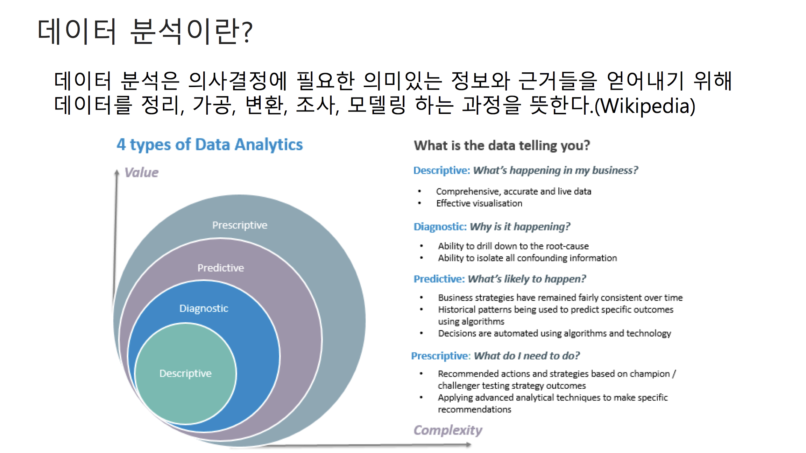

AWS 데이터 분석 특집 웨비나 - 빠르고 손쉽게 클라우드 기반 데이터 분석 시작하기 
---

## 목차
- 데이터 분석의 개요
- 데이터 분석 on AWS
- DEMO

## 1. 데이터 분석의 개요

### 데이터 분석의 주요 과정

### 데이터 분석과 엔지니어링
데이터가 우리에게 간단하게 전달되지 않는다.

## 2. 데이터 분석 on AWS

S3는 데이터레이크라고 이해하면 됨!

서버리스 Ad-hoc 쿼리 엔진 - Amazon Athena
- 표준 SQL을 사용해서 Amazon S3의 데이터를 분석하는 대화식 쿼리 서비스
- 설정 및 관리해야 할 인프라도 없으며, 로드 해야할 데이터도 없음
- Amazon Glacier에 보관된 데이터에 대해 SQL 쿼리 실행 가능
- 약 5$/1TB 

~~퀵사이트는 개인적으로 불호~~

### 데이터 분석 파이프라인과 확장

## 3. DEMO

Amazaon Open Data에 접근하면 무료로 사용할 수 있는 데이터들이 있다.
- 영상 참고
- https://registry.opendata.aws/
- https://registry.opendata.aws/amazon-reviews/
- 실습은 별도로 진행 예정