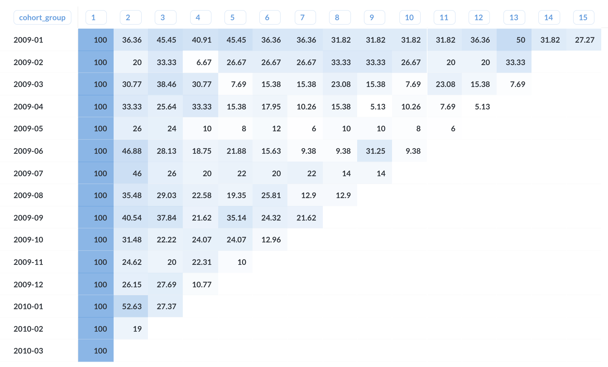

Cohort analysis with MySQL
----

### 문서 목적
MySQL을 이용하여 Cohort 분석에 사용할 쿼리와 retention rate 결과를 정리하기 위해 작성하였다.


### Cohort analysis
- https://clevertap.com/blog/cohort-analysis/


### 작업 환경
- MySQL : [8.0(with docker)](https://hub.docker.com/_/mysql)
- BI tool : [Metabase v0.34.3](https://www.metabase.com/)
- Data_set : relay_foods.csv
  - Python으로 구현 할 때 사용한 데이터 셋에서 약간의 가공을 거쳐서 사용하였음
  - [Python에서 사용한 데이터 셋](https://github.com/timetobye/TIL/tree/master/Python/8_Python_code_for_analysis/Data_set)

### 작업 결과



### Query statement

```sql
with base_table as (
        select
            order_id,
            date_format(order_date, '%Y-%m') as order_period,
            Total_Charges,
            user_id,
            date_format(pickup_date, '%Y-%m') as pickup_dt
        from log_table),
    user_first_order as (
        select
            user_id,
            min(order_period) as cohort_group
        from base_table
        group by 1),
    cohort_group_table as (
        select
            ufo.cohort_group as cohort_group,
            bt.order_period as order_period,
            count(distinct  bt.user_id) as count_user_id,
            count(distinct bt.order_id) as count_order_id,
            sum(bt.Total_Charges) as sum_total_charges,
            ROW_NUMBER () over (
                PARTITION by ufo.cohort_group
                order by bt.order_period asc) as cohort_period
        from base_table as bt
        left join user_first_order as ufo on bt.user_id = ufo.user_id
        group by 1, 2),
    result as (
        select
            cohort_group,
            cohort_period,
            count_user_id,
            max(count_user_id) over (
                PARTITION by cohort_group) as partiotion_sum_cohort_group
        from cohort_group_table
    )
        

select
    cohort_group,
    cohort_period,
    (count_user_id / partiotion_sum_cohort_group) * 100 as cohort_ratio
from result
```

### 내용 정리
기본적인 원리는 [Python - cohort analysis](https://github.com/timetobye/TIL/tree/master/Python/8_Python_code_for_analysis/Cohort_analysis)
 을 할 때와 때와 동일합니다.

#### Table 구성
Python 에서 사용한 엑셀 파일을 바로 사용하면 에러가 나서, 약간의 변형을 주었습니다.

```sql
create table log_table (
  order_id int,
  Order_Date datetime,
  user_id varchar(255),
  Total_Charges float,
  common_id varchar(255),
  pup_id int,
  pickup_date datetime
);
```

csv 파일은 datagrip을 이용해서 import 하였는데, 자신의 방식에 맞게 사용하면 됩니다.

#### base_table & user_first_order
log_table에서 필요한 부분을 전처리 해서 base_table 을 만들었습니다.

그 다음에 각 이용자가 가장 처음에 이용한 시점을 구하기 위해서 user_first_order 를 만들었습니다. 

```sql
with base_table as (
        select
            order_id,
            date_format(order_date, '%Y-%m') as order_period,
            Total_Charges,
            user_id,
            date_format(pickup_date, '%Y-%m') as pickup_dt
        from log_table),
    user_first_order as (
        select
            user_id,
            min(order_period) as cohort_group
        from base_table
        group by 1),
```

#### cohort_group_table & result
cohort group을 구현하기 위해서 몇 가지 함수들을 이용하였습니다.
- count
- sum
- row_number with window function

window function을 이용하면 특정 값을 기준으로 구간을 나누어서 번호를 지정할 수 있습니다.

```sql
    cohort_group_table as (
        select
            ufo.cohort_group as cohort_group,
            bt.order_period as order_period,
            count(distinct  bt.user_id) as count_user_id,
            count(distinct bt.order_id) as count_order_id,
            sum(bt.Total_Charges) as sum_total_charges,
            ROW_NUMBER () over (
                PARTITION by ufo.cohort_group
                order by bt.order_period asc) as cohort_period
        from base_table as bt
        left join user_first_order as ufo on bt.user_id = ufo.user_id
        group by 1, 2),
    result as (
        select
            cohort_group,
            cohort_period,
            count_user_id,
            max(count_user_id) over (
                PARTITION by cohort_group) as partiotion_sum_cohort_group
        from cohort_group_table
    )
```

마지막으로 result table 을 만들어서 각 cohort group 별로 초기 시작 값을 구합니다.

이 값은 % 를 구할 때 사용됩니다.


#### cohort ratio
아래와 같이 쿼리를 한 다음, metabase에서 제공해주는 pivot 기능을 이용합니다.
- Pivot column : cohort_period
- Cell column : cohort_ratio

```sql
select
    cohort_group,
    cohort_period,
    (count_user_id / partiotion_sum_cohort_group) * 100 as cohort_ratio
from result
```


### 마무리
인터넷에 나와있는 복잡한 방법들 대신에 기본적인 쿼리를 조합하여 만들어 보았습니다.

MySQL 8.0에서 적용된다는 단점(8.0 미만의 버전에서는 windo function이 안 됩니다.)이 있지만 다른 DBMS의 경우 대부분 window function을 지원하기 떄문에 
유용하게 사용할 수 있다고 봅니다.

Cohort group 을 이용하여 retention 까지 구해서 사용자 분석에 적극 응용하도록 합시다.

