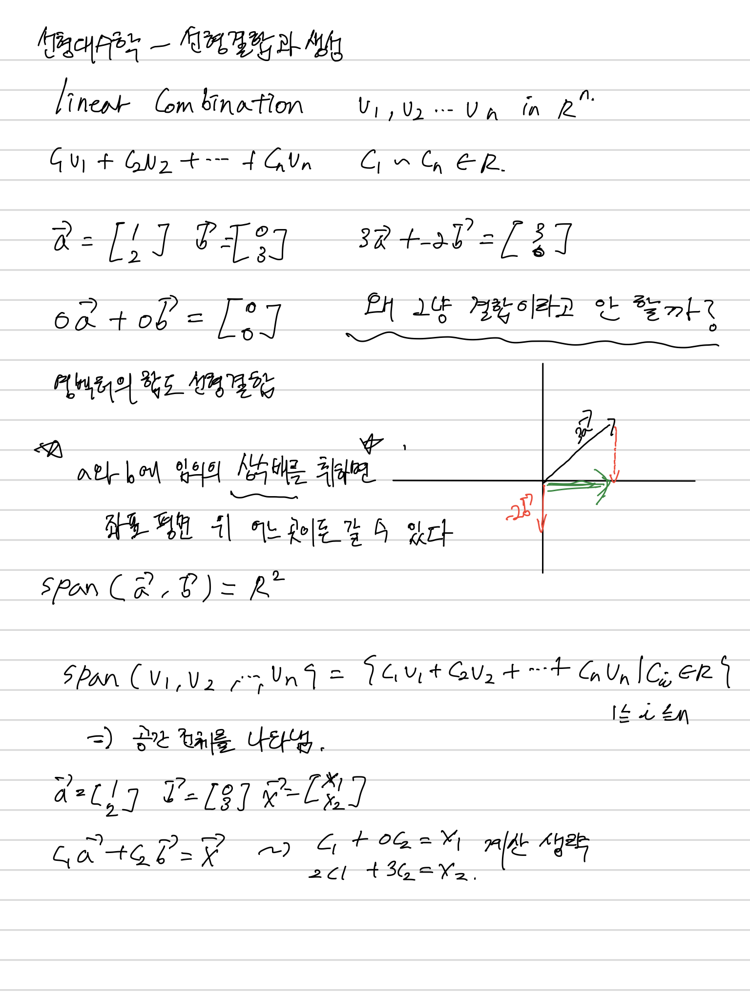
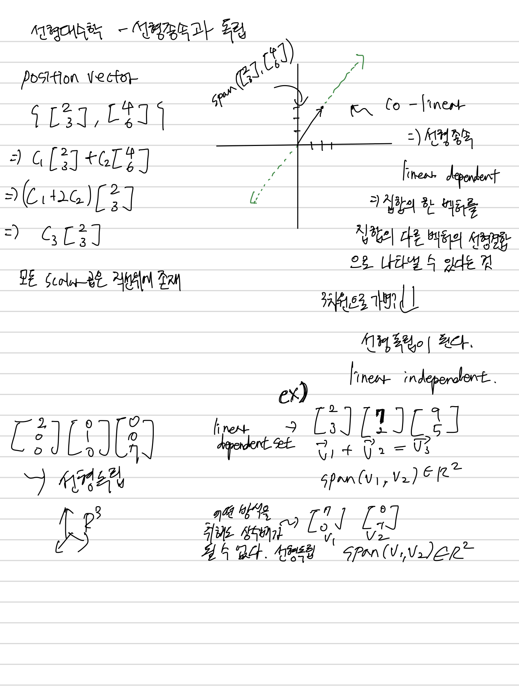
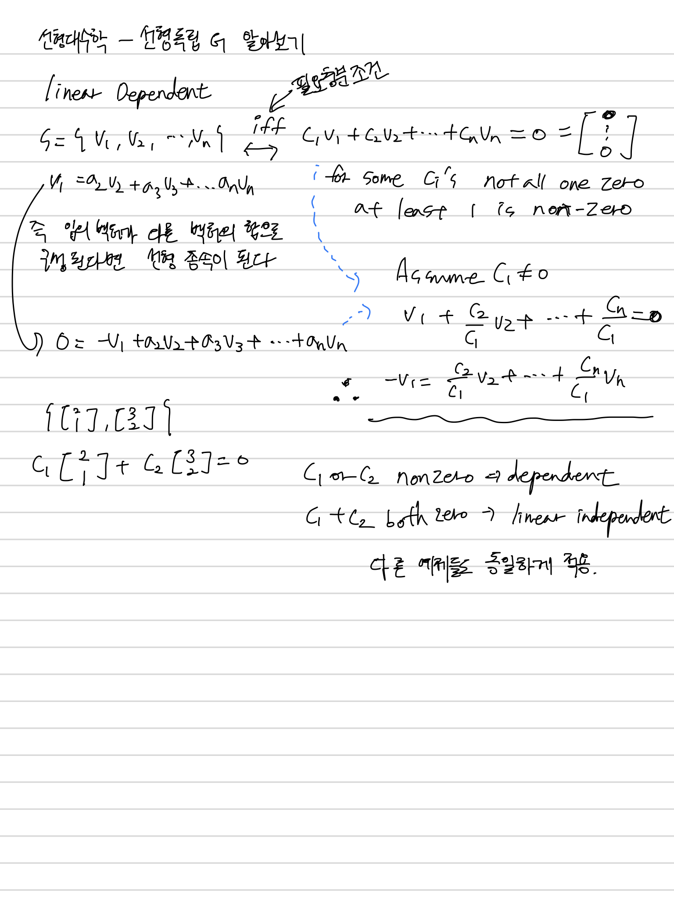

Vector and Space
----------------

# Linear_combinations_and_spans

## lecture
lecture url
- https://ko.khanacademy.org/math/linear-algebra/vectors-and-spaces/linear-combinations/v/linear-combinations-and-span

참고 자료
- 선형 독립, 선형 종속 : https://rfriend.tistory.com/163?category=606751
- basis(기저) : https://rfriend.tistory.com/164?category=606751

## Note

