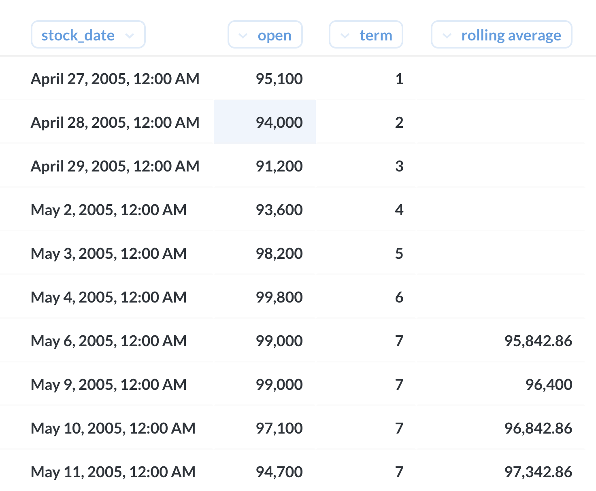
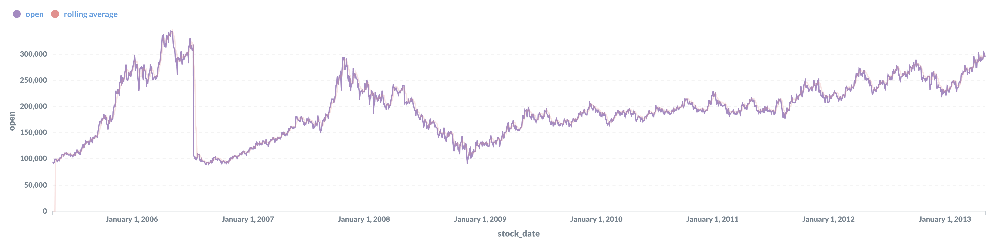

일별 가입자 수 & 7일 내 재방문 수
----

### 문서 목적
주식 데이터를 이용하여 7일 이동 평균을 구한다.

### 작업 환경
- MySQL : [8.0(with docker)](https://hub.docker.com/_/mysql)
- BI tool : [Metabase v0.35.4](https://www.metabase.com/)

### 이동 평균
- open column 의 7일 이동 평균을 구한다. 
- 처음 7일은 데이터가 없기 때문에 값을 구할 수 없다. 공란으로 처리 된다.

### 작업 결과
7일 이동 평균을 구한다. ~~이 때 샀으면 부자가 됐겠지...~~~



7일 이동 평균이라 크게 차이는 없다.



### Query statement

window function을 이용하여 구한다.
- 핵심은 현재(특정 날짜)로부터 6일 이전의 row를 찾는 것이 핵심

```sql
select
    stock_date,
    open,
    count(*) over (order by stock_date rows between 6 preceding and current row) as term,
    case
        when count(*) over (order by stock_date rows between 6 preceding and current row) = 7
        then avg(open) over (order by stock_date rows between 6 preceding and current row)
    end as "rolling average"
from stock_price
where Company = 'naver'
```