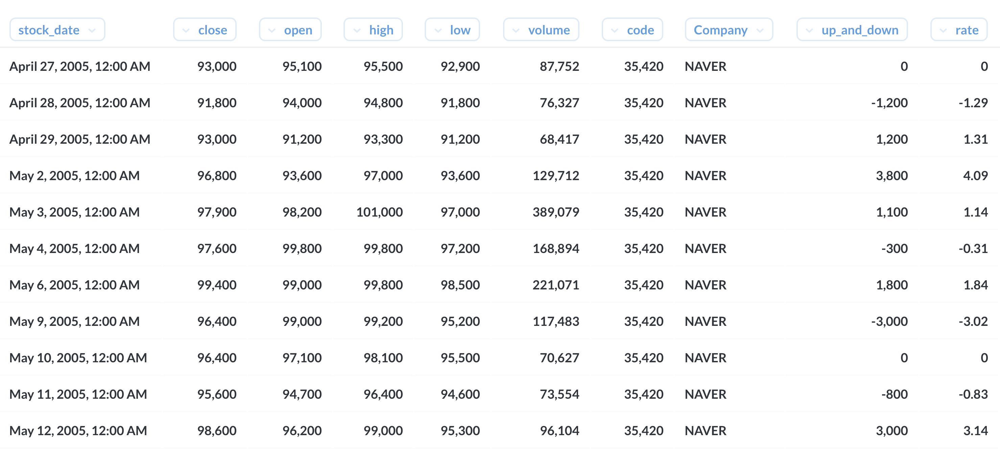
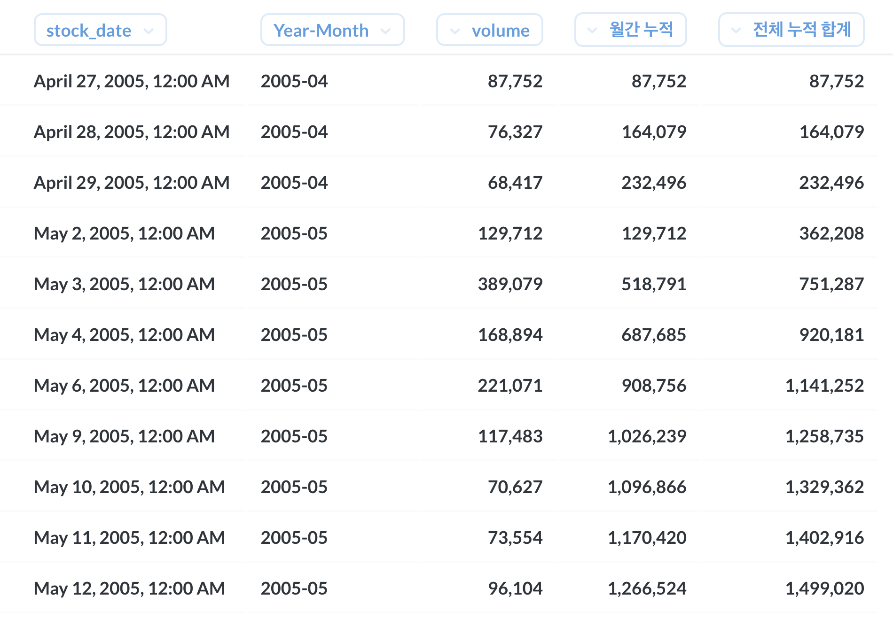

일별 가입자 수 & 7일 내 재방문 수
----

### 문서 목적
주식 데이터를 이용하여 누적 합계를 구하는 쿼리를 작성한다.

누적 합계는 volume column 을 이용해서 한다.

### 작업 환경
- MySQL : [8.0(with docker)](https://hub.docker.com/_/mysql)
- BI tool : [Metabase v0.35.4](https://www.metabase.com/)

### 누적 합계
- volume column 의 누적 합계를 구한다. 
- 기업은 naver를 이용한다.

네이버를 조회 하면 아래와 같다.



### 작업 결과



### Query statement

window function을 이용하여 구한다.

```sql
select
    stock_date,
    date_format(stock_date, '%Y-%m') as "Year-Month",
    volume,
    sum(volume) over (partition by date_format(stock_date, '%Y-%m') order by stock_date asc) as "월간 누적",
    sum(volume) over (order by stock_date asc) as "전체 누적 합계"
from stock.stock_price
where Company = 'naver'
order by 1 asc
```