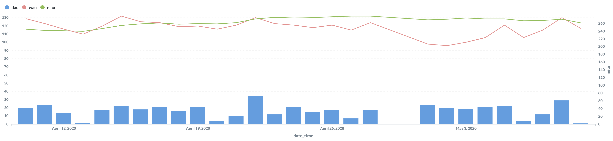

DAU, WAU, MAU
----

### 문서 목적
MySQL을 이용하여 DAU, WAU, MAU 를 구하기 위해 작성하였습니다.

모바일 분석의 기초이기 때문에 정리와 이해를 해서 자주 사용하도록 합니다.

### DAU, WAU, MAU?
- DAU : Daily Activity User, 1일 간 이용한 순수 이용자 수
- WAU : Weekly Activity User, 7일 간 이용한 순수 이용자 수 
- MAU : Monthly Activity User, 30일 간 이용한 순수 이용자 수

### 작업 환경
- MySQL : [8.0(with docker)](https://hub.docker.com/_/mysql)
- BI tool : [Metabase v0.34.3](https://www.metabase.com/)
- Data_set : relay_foods.csv
  - Python으로 구현 할 때 사용한 데이터 셋에서 약간의 가공을 거쳐서 사용하였음
  - [Python에서 사용한 데이터 셋](https://github.com/timetobye/TIL/tree/master/Python/8_Python_code_for_analysis/Data_set)

### 작업 결과


### 참고 페이지
- https://discuss.redash.io/t/dau-wau-mau-query-example/1704
- https://stackoverflow.com/questions/24494373/querying-dau-mau-over-time-daily
- https://brunch.co.kr/@supims/165

### Query statement
데이터가 2010년 이전의 데이터여서 2020년 버전으로 바꾸기 위해 전처리를 해주었습니다.

기본적으로 base_table 을 만든 다음에 dau, wau, mau 를 구현하였습니다.

```sql
with base_table as (
        select
            order_id,
            date_add(Order_Date, interval '10:2' year_month) as new_order_date,
            user_id,
            Total_Charges,
            common_id,
            pup_id,
            date_add(pickup_date, interval '10:2' year_month) as new_pickup_date
        from log_table),
    dau as (
        select
            date_format(new_order_date, '%Y-%m-%d') as date_time,
            count(distinct user_id) as dau
        from base_table
        group by 1
        having date_time > date_sub(curdate(), interval 30 day)
        order by 1 asc)
        
select
    date_time,
    dau,
    (
        select
            count(distinct user_id)
        from base_table
        where base_table.new_order_date BETWEEN date_sub(dau.date_time, interval 7 day) and dau.date_time
    ) as wau,
    (
        select
            count(distinct user_id)
        from base_table
        where base_table.new_order_date BETWEEN date_sub(dau.date_time, interval 30 day) and dau.date_time
    ) as mau
from dau;
```

### 내용 정리
기본적인 테이블 구성은 cohort 분석을 할 때와 동일 합니다.

#### Table 구성
```sql
create table log_table (
  order_id int,
  Order_Date datetime,
  user_id varchar(255),
  Total_Charges float,
  common_id varchar(255),
  pup_id int,
  pickup_date datetime
);
```

#### base_table & dau
log_table에서 필요한 부분을 전처리 해서 base_table 을 만들었습니다. 앞서 말씀드린대로, 2010년대의 데이터라서 2020년대로 변형하였습니다.

dau 는 각 날짜의 이용자 수를 구하면 됩니다.

```sql
with base_table as (
        select
            order_id,
            date_add(Order_Date, interval '10:2' year_month) as new_order_date,
            user_id,
            Total_Charges,
            common_id,
            pup_id,
            date_add(pickup_date, interval '10:2' year_month) as new_pickup_date
        from log_table),
    dau as (
        select
            date_format(new_order_date, '%Y-%m-%d') as date_time,
            count(distinct user_id) as dau
        from base_table
        group by 1
        having date_time > date_sub(curdate(), interval 30 day)
        order by 1 asc)
```

#### Dau, Wau, Mau
각 항목의 정의에 맞게 구현을 하면 됩니다. 본질은 특정 기간 내에 접속한 이용자 수 입니다.

서브쿼리를 이해하기가 쉽지 않았는데, 결국 지정된 날짜를 기준으로 7일, 30일 전후의 이용자를 구한다고 생각하니 이해가 되었습니다. 

````sql
select
    date_time,
    dau,
    (
        select
            count(distinct user_id)
        from base_table
        where base_table.new_order_date BETWEEN date_sub(dau.date_time, interval 7 day) and dau.date_time
    ) as wau,
    (
        select
            count(distinct user_id)
        from base_table
        where base_table.new_order_date BETWEEN date_sub(dau.date_time, interval 30 day) and dau.date_time
    ) as mau
from dau;
````


#### 마무리
DAU, WAU, MAU 는 프로덕트의 지표를 확인할 때 가장 먼저, 쉽게 확인할 수 있는 지표입니다.

Firebase 와 같은 tool을 이용해서도 확인할 수 있고, 그렇지 않으면 직접 구현하기도 합니다.

수치 하나 하나에 집중하기 보다는 흐름에 집중해서 살펴보는 것이 옳다고 생각하는 항목입니다. 