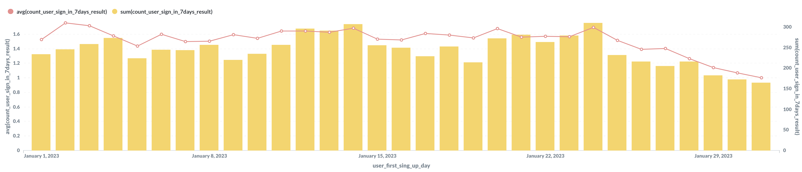

일별 가입자 수 & 7일 내 재방문 수
----

### 문서 목적
MySQL을 이용하여 일별 가입자 수와 가입 후 7일 내 재방문 수를 구하였습니다.

### 일별 가입자 수, 7일 내 재방문 수
- 일별 가입자 수 : 날짜별 sign_up 한 수
- 7일 내 재방문 수 : 이용자가 7일 이내에 재방문 한 기록 


### 작업 환경
- MySQL : [8.0(with docker)](https://hub.docker.com/_/mysql)
- BI tool : [Metabase v0.34.3](https://www.metabase.com/)
- Dataset : 업로드 예정, 아래와 같은 구성으로 되어 있다.

```bash
+--------------------------------------+------------+---------------------+
| user_uuid                            | action_log | action_log_datetime |
+--------------------------------------+------------+---------------------+
| 3cc65aa6-f823-4b9e-8f64-9d8cb0d2e7be | sign_up    | 2023-01-01 00:00:18 |
| 3cc65aa6-f823-4b9e-8f64-9d8cb0d2e7be | action_E   | 2023-01-01 00:00:24 |
| 3cc65aa6-f823-4b9e-8f64-9d8cb0d2e7be | action_E   | 2023-01-01 00:00:29 |
| 3cc65aa6-f823-4b9e-8f64-9d8cb0d2e7be | action_E   | 2023-01-01 00:00:34 |
| 3cc65aa6-f823-4b9e-8f64-9d8cb0d2e7be | action_F   | 2023-01-01 00:00:39 |
| 3cc65aa6-f823-4b9e-8f64-9d8cb0d2e7be | action_B   | 2023-01-01 00:00:42 |
| 3cc65aa6-f823-4b9e-8f64-9d8cb0d2e7be | action_B   | 2023-01-01 00:00:48 |
| 3cc65aa6-f823-4b9e-8f64-9d8cb0d2e7be | action_F   | 2023-01-01 00:00:56 |
| 3cc65aa6-f823-4b9e-8f64-9d8cb0d2e7be | action_B   | 2023-01-01 00:00:58 |
| 3cc65aa6-f823-4b9e-8f64-9d8cb0d2e7be | action_B   | 2023-01-01 00:00:59 |
| 3cc65aa6-f823-4b9e-8f64-9d8cb0d2e7be | action_B   | 2023-01-01 00:01:01 |
| 3cc65aa6-f823-4b9e-8f64-9d8cb0d2e7be | action_F   | 2023-01-01 00:01:10 |
| 3cc65aa6-f823-4b9e-8f64-9d8cb0d2e7be | action_C   | 2023-01-01 00:01:12 |
| 3cc65aa6-f823-4b9e-8f64-9d8cb0d2e7be | action_C   | 2023-01-01 00:01:13 |
| 3cc65aa6-f823-4b9e-8f64-9d8cb0d2e7be | action_C   | 2023-01-01 00:01:15 |
| 3cc65aa6-f823-4b9e-8f64-9d8cb0d2e7be | action_C   | 2023-01-01 00:01:20 |
| 3cc65aa6-f823-4b9e-8f64-9d8cb0d2e7be | action_C   | 2023-01-01 00:01:21 |
| 3cc65aa6-f823-4b9e-8f64-9d8cb0d2e7be | action_C   | 2023-01-01 00:01:23 |
| 3cc65aa6-f823-4b9e-8f64-9d8cb0d2e7be | action_F   | 2023-01-01 00:01:30 |
| 3cc65aa6-f823-4b9e-8f64-9d8cb0d2e7be | action_C   | 2023-01-01 00:01:31 |
+--------------------------------------+------------+---------------------+
```

### 작업 결과



### Query statement

```sql
with base_table as (
        select
            user_uuid,
            action_log,
            date_format(action_log_datetime, '%Y-%m-%d') as action_log_datetime
        from action_log_table),
    user_first_sing_up as (
        select
            user_uuid,
            min(action_log_datetime) as user_first_sing_up_day
        from base_table
        group by 1),
    date_diff_table as (
        select
            bt.user_uuid,
            ufsu.user_first_sing_up_day,
            datediff(bt.action_log_datetime, user_first_sing_up_day) as date_diff
        from base_table as bt
        left join user_first_sing_up as ufsu on bt.user_uuid = ufsu.user_uuid),
    count_user_sign_in_7days as (
        select
            user_uuid,
            user_first_sing_up_day,
            count(distinct date_diff) as count_user_sign_in_7days_result
        from date_diff_table
        where date_diff <= 7
        group by 1, 2)
    
select
    user_first_sing_up_day,
    avg(count_user_sign_in_7days_result),
    sum(count_user_sign_in_7days_result)
from count_user_sign_in_7days
group by 1
order by 1 asc
```