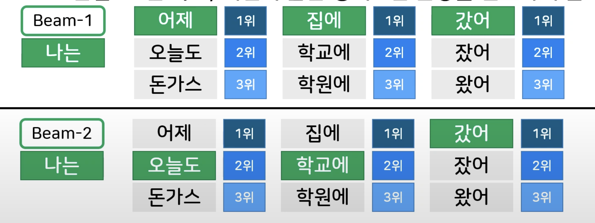

GPT로 알아보는 생성모델(구상준 - 스캐터랩)
----

## 문서 목적
[GPT로 알아보는 생성모델](https://www.youtube.com/watch?v=qsb-9fYLVkk)을 보고 내용을 정리한 문서이다.

**이 문서는 GPT로 알아보는 생성 모델 영상을 바탕으로 정리한 내용 입니다.**

## 1.GPT 이전의 생성 모델

### 생성 모델이란?

예문을 들어서 설명을 해주심
- 코로나에 비까지 계속 오니 이번 여름 휴가는 (    )
  - 고마웠네 / **망했어** / 가볍다
  - 망했어를 골랐다는 것은 가장 그럴듯했기 때문
- 컴퓨터의 입장에서 "그럴듯하다" 는 무슨 뜻일까?
  - **앞 단어들이 있을 떄, 나올 확률이 높은 것**

생성 모델의 정의
- 앞 단어들로부터 "그럴듯한 단어"를 예측할 수 있는 모델
- 순차적으로 단어를 예측해서 온전한 문장을 완성하는 모델

단어가 입력 -> 예측
- 예측 단어가 다시 입력이 됨
- 반복
- 온전한 문장 생

출력을 입력으로 받는 신경망 생성 모델(RNN)
- 출력이 다음입력으로 들어가는 구조
- 신경망의 상태가 입력에 따라 매 단계마다 갱신됨

## 2.GPT 생성 모델의개요와 예시

### RNN의 문제점
- 긴 의존관계 문제(Long Dependency Problem)
  - 먼 앞쪽에 나온 단어의 영향력을 모델이 잊어버리는 현상
  - 가까운 단어에 의존해서 단어를 선택하게 됨

예시
- 야식은 다음에 어떤 단어가 와야 할까?
  - 치킨 피자보다는 족발이 와야 하는데 치킨, 피자가 올 수도 있다

어떻게 하면 "족발"이라는 단어가 뒤에 있는 출력에 기여하게 할 수 있을까?

해결책!

### Attention 모델
- 각 입력 단어가 출력 상태와 직접적으로 연결되는 구조
- 각 단어의 영향력을 **신경망 가중치**의 형태로 나타냄
- 멀리 있는 입력 단어도 **출력에 기여 가능**
  
Attention 으로 표현하는 단어 관계
- Attention 가중치만으로도 단어의 상관관계를 표현할 수 있을까? 

어떤 단어의 상관 관계는 단어 A에 X 만큼 중요한 단어 B가 미치는 영향을 찾는다.
- Query: 단어 A에 해당하는 부분
- value : 단어 B의 중요도
- Key : 단어 B에 해당하는 부분 

### Transformer
이런 Attention을 여러 층으로 묶은 구조가 Transformer 구조이다
- 언어 모델을 Attention 만으로 나타낸 구조
- 입력 단어를 양방향으로 확인하는 인코더(Encoder)
- 단방향으로 생성하는 디코터(Decoder)

인코더는 양방향 확인
- 훨씬 단어와 문장을 잘 이해할 수 있지만, 반대로 다음 단어가 전 단어에 기여하기 떄문에 생성 모델로는 기여할 수 없음

### GPT 생성 모델(2018)
언어 모델을 디코더로만 나타낸 구조
- 전에 나온 단어들만 기여하기 때문에 문장을 온전히 생성 가능
- Auto-Regressive(자신 혼자 추론 가능함)

### GPT 생성 모델의 동작 얼개
입력 단어 -> 입력 벡터 -> Hidden 벡터 -> 출력 단어 확률 -> 출력 단어

입력 단어
- 벡터 형태로 변환

입력 벡터 & Hidden 벡터
- 여러 디코더 층을 거쳐 순차 계산 -> 하나의 Hidden 벡터로 표현

 
출력 단어 확률
- Hidden 벡터로부터 각 단어별 출력 확률 도출

출력 단어
- 출력 확률이 가장 높은 단어 선택

### GPT의 단어 선택 전략
GPT는 확률 분포라는 형태로 출력 단어를 제안함
- 하지만 어떤 단어를 선택하느냐는 전적으로 개발자의 몫임
  - 높은 확률의 출력 단어는 말이 될 가능성이 높지만 재미 없음
  - 낮은 확률의 출력 단어는 말이 되지 않겠지만 훨씬 풍부함
  - 타협점을 찾아야 함

#### 선택 전략 - Greedy
확률이 제일 높은 단어만 계속 선택
- 장점 : 속도가 빠르고 메모리를 적게 먹음, 구현이 간단함
- 단점 : 흔한 형태로만 문장이 출력됨, 문장의 질이 낮음
  

#### 선택 전략 - Beam Search
선택된 문장 후보군들을 몇 개씩 기억하는 방법
- 장점 : 보다 더 좋은 문장을 만들 수 있음
- 단점 : 느린 속도, 여전히 흔한 형태로만 문장을 선호하게 됨

#### 선택 전략 - Direct Sampling
단어를 선택하지 말고, 확률 분포에 따라서 추출
- 장점 : 이전 방법들에 비해 훨씬 다양한 문장을 생성함
- 단점 : 말이 되지 않는 단어가 선택될 가능성이 존재

## 3.GPT 생성 모델의 미래와 한계

GPT 생성 모델의 발전 추이
- GPT(2018, 110M parameter)
- GPT-2(2019, 1.5B)
- GPT-3(2020, 175B)

GPT3
- 1750억 파라미터의 대화 모델
- 단순히 다음 단어 맞추기만 훈련시켰는데 놀라운 일들을 함

### 한계
상식의 부재
- 보지 않은 문장에 대해서는 잘 대답을 못함
- 너무 뻔해서 사람들이 글로 남기지 않은 세상 상식은 잘 대응을 못함
  - 태양에는 발이 몇 개 있지? -> 8개(태양에는 발이 없음...)

기억의 부재
- GPT에는 별도의 기억 모듈이 없음
- Decoder가 다루는 범위까지만 기억 가능
- 1달 전에 말했던 내용은 기억 못 함

매우 거대한 모델 크기
- GPT는 너무 무거움
- 훈련 비용만 50억이 소요

 

