A/B 테스트 기법
----

## 문서 목적
A/B 테스트 기법 강의를 수강 후 내용 정리하기 위한 문서

## 강의 개요
- 강의 링크 : https://tacademy.skplanet.com/live/player/onlineLectureDetail.action?seq=160
- 학습 내용
  - A/B테스트의 기본 개념 및 배경, 적용 사례에 대해 알아본다.
  - A/B테스트 설계과정 및 결과 평가방법, 실무 적용시 주의점 등에 대해 알아본다.
- 강사 : 권정민 데이터분석가

----------

## 1강. A/B 테스트란

### A/B 테스트란
A/B 테스팅이란 임의로 나눈 두 집단에게 서로 달느 컨텐츠를 제시한 후 두 집단 중 어떤 집단이 더 높은 성과를 보이는지 정량적으로 
평가하는 방식
- '무작위 비교 연구'라 불리는 방법을 서비스에 적용한 방법
- 실무쪽에서 다루는 기술이나 방법론도 용어 등이 변경된 것이라서 기존에 연구된 것을 실무에 사용한 것임

### 고객 분석을 위한 테스트
고객의 행동을 파악하고 데이터를 수집하기 위한 환경이 좋아짐

고객 분석
- 종단적 연구
  - 고객들이 사용한 정도에 따라서 분석하는 방법 
  - 코호트 분석 : 사람이 사용한 정도에 따라 나누는 분석
- 횡단적 연구 : 고객군을 임의로 나누어서 군별로 어떻게 다룬지 실험
  - A/B 테스트
  - 다변량 분석
  
### 사례 소개

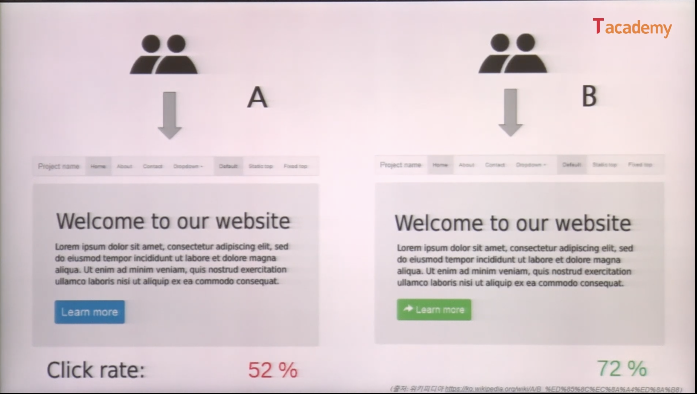

### A/B 테스트

1. 실제 대상자를 반으로 나눈 후
2. 두 가지 포맷의 테스트 자료(버튼, 이미지 등을 바꿈)를 만들어서
3. 이를 A, B 그룹 각각에 제공
4. 이에 따라 각 그룹이 얼마나 반응했는지를 판단
5. 결과가 우수한 내용을 실전에 반영

원래 모든 것은 다 잘하기는 어렵다.
- a/b 테스트는 실무에서 고객들을 대상으로 임의로 하는거기 때문에, 대충하면 하지 않는 것만 못 하다.
- 잘, 많이, 넘어가는 것이 중요하다.

### A/B 테스트의 배경

우리는 외부 요인을 다 컨트롤 할 수는 없다.

내성성 vs. 외생성
- 내생성 : 해당 시스템 내에서 결정되거나 생성되는 것
- 외생성 : 시스템 밖의 요소로 결정되거나 생성되는 것

예를 들면, 비가 올 때 우산을 들고 나가서 장사를 하는 것 vs 비가 안 와서 장사를 망침
- 천재지변 같은 것은 외생성

사용자의 행동
- 많은 경우 여러 가지 요소가 복합적으로 작용함
  - 외생성 및 고려하는 변수의 영향으로 명확한 요인 및 원인 분석 어려움
- 많은 실제 상황(실무)의 경우 내생성을 위한 시스템을 일부 요소만으로 구축하기 어려움

상관관계는 인과관계를 나타내지 않는다
- 최대한 다른 요인을 제거함으로써 인과관계에 최대한 가까운 근거를 만들고자 함
  - 무엇을 하면 어떻게 되더라 를 만들기 위해서 하는 것이 A/B 테스트
  
~ 때문에 ~ 이다 라는 문장을 만들기가 어렵다.
- 서비스를 추가 했는데 뭐가 잘 됐다. 는 판단하기 어려움
  - 프로모션, 서비스 성장 중, 경쟁 서비스가 적다, 등등등
  - 대부분의 일들은 한 가지 요인만으로 달라지기는 어렵다.

두 집단에게 거의 동일한 시간에 화면을 다르게 보여줘서 결과를 얻음

### A/B 테스트 실제 사용 사례

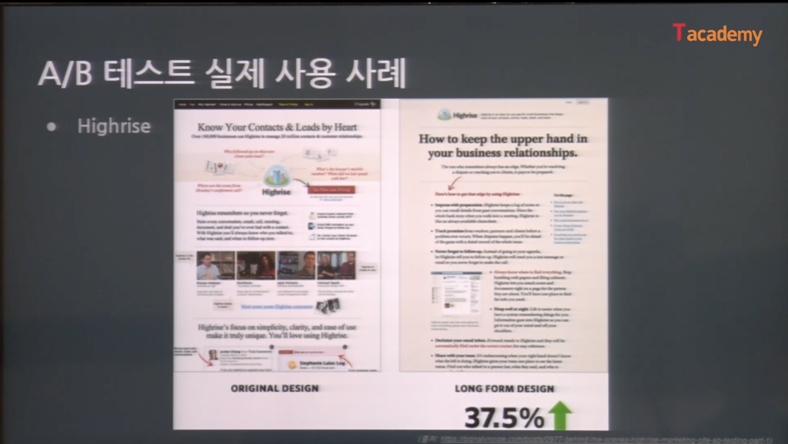

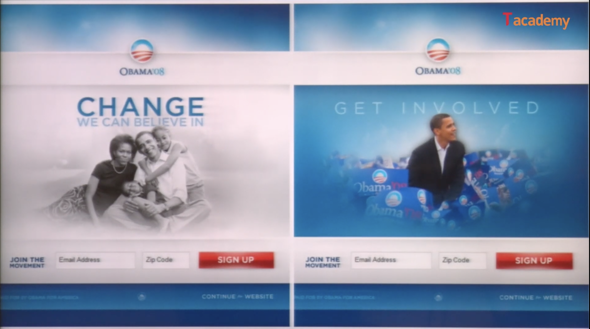

## 2강. A/B 테스트 설계

### 실험 설계
Experimental design
- 실험 계획법 : 실험에 대한 계획방법으로, 해결하려는 문제에 대하여 실험방법, 데이터 수집, 통계분석들을
통하여 최소의 실험 횟수로부터 최대의 정보를 획득하도록 계획하는 것
- 로널드 피셔 : 유명한 통계학자

A/B 테스트
- 사용자의 반응도에 대한 실험 -> 사용자를 대상으로 한 실제 환경에서의 실험 

### 사회조사방법론에서의 실험 설계

A/B 테스트는 유사실험조사설계
- 실험환경은 최대한 세팅
- 사용자 집단을 다르게 한 뒤에, 환경이 다를 때 어떻게 하는가
- 비동일통제집단 전후비교설계 -> 약식으로 하면 A/B 테스트, 이것을 제일 많이 함
- 시계열설계, 복수시계열설계

전실험조사설계
- 외적 타당도도 무척 낮고, 실험의 근거가 없음
- 실험이라고 보기에는 좀 어려움
- 사회조사 쪽에서는 논문을 쓸 때 어쩔 수 없이 씀

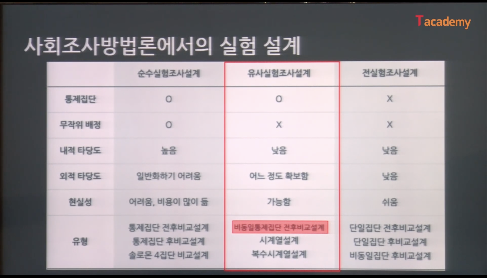

### 유사실험설계의 특징
- 사회 현상에서의 인과관계 판단용
  - 인과 관계를 만들고 싶어서 A/B 테스트를 하는 거임
- 순수실험설계만큼의 통제가 불가한 환경에서 대안적인 방식으로 통제 집단을 구성함
  - 감옥에 사람을 넣고 통제할 수는 없으니...
- 외생변수의 개입 가능성이 높음
  - 시계열 같은 경우는 굉장히 많이 작용
  - 주중 / 주말 접속 패턴 등 단순한 것부터....다름
- 실험에 대한 통제가 적으므로 외적 타당성이 상대적으로 높아 현실 문제 해결에 유용함

### 실험 설계 과정

1. 대상선정 : 연구대상을 선정
2. 실험환경 선정 : 실험실, 실험 도구 등의 실험 환경을 선정
3. 무작위표집 : 연구대상을 무작위로 표본추출
4. 무작위할당 : 추출된 표본을 무작위로 실험집단과 통제집단에 배치
5. 사전검사 : 두 집단에 종속변수에 대한 사전검사를 실시
6. 실험조치 : 실험집단에만 실험조치를 실시
7. 사후검사 : 두 집단에 종속변수에 대한 사후검사를 실시
8. 비교 및 검증 : 사전, 사후검사 결과 변수 간의 의미있는 변화를 비교

### A/B 테스트 실험 설계 과정

1. 대상선정 : 연구대상을 선정 -> **사용자 및 지표**
2. 실험환경 선정 : 실험실, 실험 도구 등의 실험 환경을 선정 -> 실제/실제 예정 환경(어떤 것을 변경 비교 할 것인가)
3. 무작위표집 : 연구대상을 무작위로 표본추출 -> 사용자 무작위 선정(실제 환경이기 떄문에...)
4. 무작위할당 : 추출된 표본을 무작위로 실험집단과 통제집단에 배치(난수 생성해서 홀짝으로 구분, 아이디 기준 홀짝, 가입 시간 등)
5. 사전검사 : 두 집단에 종속변수에 대한 사전검사를 실시 -> 실험 환경 확인
6. 실험조치 : 실험집단에만 실험조치를 실시 -> 분기
7. 사후검사 : 두 집단에 종속변수에 대한 사후검사를 실시 -> 실험 환경 재확인
8. 비교 및 검증 : 사전, 사후검사 결과 변수 간의 의미있는 변화를 비교 -> 결과 분석

### 목적 지표 선정
가설 검정에 가장 직관적이면서 구하기 용이한 지표 선정
- 제일 중요하고, 중요하고, 사람들이 잘...안 하는 과정 -_-;;
- 내가 이 실험을 왜 하고, 얻고자 하는 것이 중요
- 정의를 잘 내리자. 궁금한 게 너무 많아지면 본질을 까먹음...
- 예를 들어, 버튼을 바꾸면 사람들이 클릭을 더 많이 할 것이다 와 같이...직관적으로 용이한 지표 선정

양적으로 확인 가능한 실질적 지표
- 감정 정도(사용자 만족도 등) 같은 모호한 지표는 제외함
- 실험을 통해서 기록되지 않은 데이터가 필요한 수치는 제외함

비율 : 사용 흐름상 전 후
- 퍼널의 실험 참여 단계 -> 실험 결과 반응 단계
- CTR(Click-Through Rate) : 클릭 수 / 페이지 뷰 수
- A/B 테스트에서는 비율을 보는 것이 좋음
  - 버튼을 바꾸기 전에는 10000명 중 3000명이 클릭했는데, 바꾼 후에는 50000명 중 4000명이 클릭
  - 실험 중 모수가 달라질 수 있음
  - 흐름 상의 변화량을 보고자 하기 때문에 비율을 본다.

실험 대상 : 사람 -> 지표 대상도 사람이 되어야 보다 정확한 결과를 얻을 수 있음
- 예 : 클릭한 사용자 / 페이지를 본 사용자

### 지표 관련 대푯값

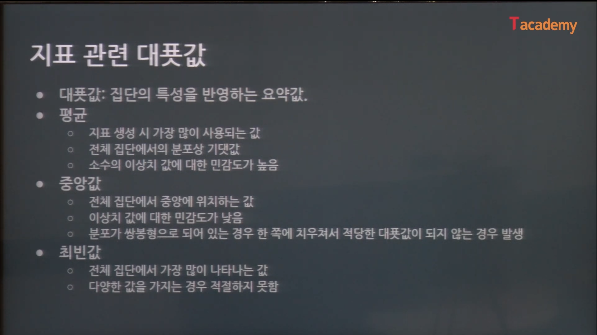

### 지표 관련 분포
다름 사람을 이해시킬 때는 그림이 최고

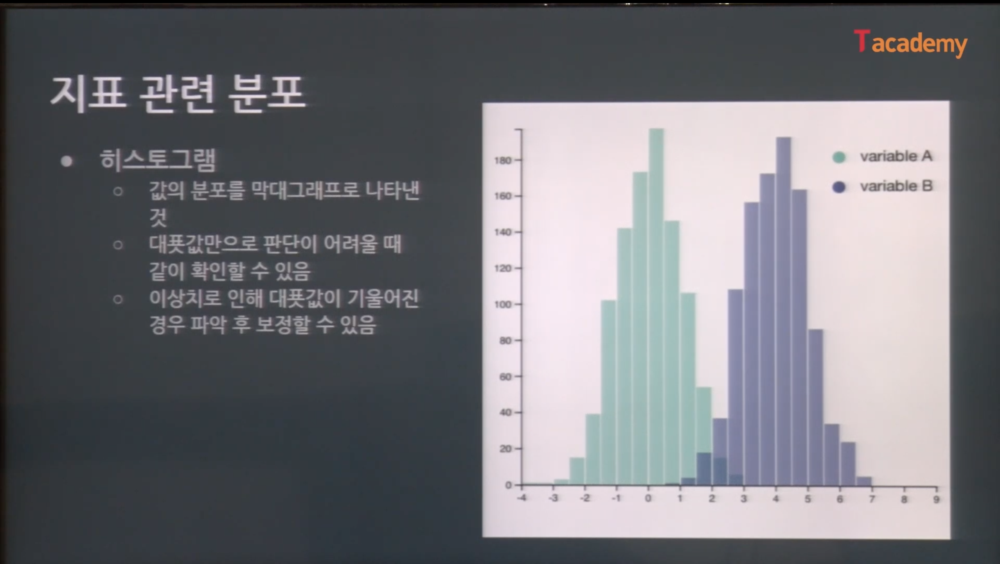

### 실습(1)

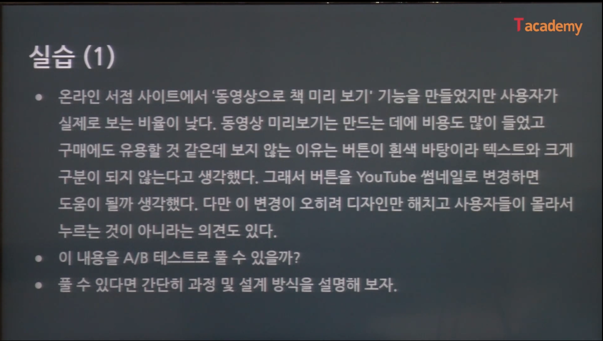

1. 가설 : 동영상 미리 보기 버튼을 유튜브 모양으로 만들어두면 사람들이 더 많이 눌러볼 것이다.
2. 지표 : click Rate
3. A/B 테스트 : 기존의 사이트와 버튼을 변경한 사이트 둘을 50%의 확률로 랜덤하게 노출시킴(한 명의 사용자가 양쪽 화면을 다 보지 않도록 하자)
4. 기간 : 1주일
5. 지표 확인 : 7일간 일별로 클릭율을 집계한 후 각각 비교 -> 각각 비교가 어렵거나 숫자가 작을 경우 평균값 비교

### 실습(2)

1. 가설 : 레벨 40의 난이도를 쉽게 하면 사용자들이 덜 이탈할 것이다.
2. 지표 : 레벨 40을 1회 플레이한 후 3일 이내 다시 게임에 접속하는 사용자 비율
3. A/B 테스트 : 레벨 40의 판을 임의로 구분한 기준에 따라 사용자(예: 사용자 번호가 끝자리 0~4까지는 기존 판, 5~9까지는 새로운 판을 제공함)에게 제공
4. 기간 : 21일
5. 지표 확인 : 일별 레벨 40을 플레이한 사용자와 그 3일 이내 재접속한 사용자의 수를 세서 그 비율을 구한다. 전체 집계를 기본으로 사용하고 일별 비교,
주별 비교를 같이 사용해서 이상치가 있는 지를 살펴본다.

## 3. A/B 테스트 실험 평가

### Q&A 세션

Q. 표본의 크기
- 실제 서비스에서 표본의 크기를 정하기 어려움
- 보통은 기존의 평균적으로 하루에 얼마나 들어오는지 감을 잡아서 대략...일주일
  - 최소 숫자를 잡고, 주말까지 포함해서 처리를 해보자
- 기본적인 지표를 확인할 떄는 하루 사용자 수로 정하면 되고, 웹페이지 같은 경우 PV(페이지뷰)수를 봐도 됨
- 내가 목표 숫자가 있으면, 목표 숫자 달성할 떄 끊는다.
- 사람이 안 들어오면....?(적게 들어올 때)
  - 신빙성이 없을 가능성이 높음
  - 통계 수치 구하는 건 무의미...-> 감으로 하시지요. 굳이 테스트보다는 ...

Q. A/B를 나누었을 때 사용자들이 완전히 동일한 사용자라고 볼 수 없다.
- 사용자들이 테스트를 하기 전에 집단의 차이가 있었는지 확인을 해주는 것이 필요
- 사용자들이 구분이 된다고 할 때(뒷자리 번호, 아이디 등...)
  - 기존의 구매율, 테스트 하기 전에 봐도 되고...
  - 테스트 후 나온 그룹을 가지고 이 사람들이 테스트 전에 어떤 행동을 했는지 확인
  - 일주일 전 후로 할 경우 A/A 테스트도 할 수 있음
  
Q. 다변량분석과 실험계획법은 다른걸로 보면 됩니다.
- 다변량분석은 A/B 테스트의 확장법으로 보면 됨

### 사용자 퍼널(Funnel)

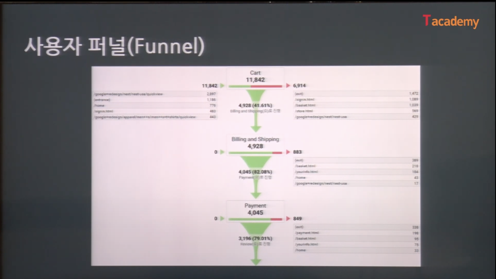

### 목표 지표의 해석

비교 전 확인
- 실험군과 대조군(A군과 B군)의 사용자 집합 크기가 동일한가?
- 실험군과 대조군의 사용자 분포가 크게 다르지 않는가?
  - 구매를 안 하는 사람들이 몰리지는 않았는지...등등 확인 필요

확인 방법
- 집합 크기가 다름 : 1대1 비교 대신 집합 크기를 통한 비교의 유의성 판단
- 분포 파악 : 성질이 다른 집합끼리의 비교는 무의미할 수 있음

유의 사항
- 실험으로 얻은 값은 항상 그와 동일한 결과를 담보하는 것이 아님
- 실험 크기가 통제가 되지 않을 경우에는 사후 추정으로 판단할 수 있음
  - 100명 중 3명 vs. 100000명 중 3000명... 비교가 유의한지 아닌지 비교
  
당연한 것을 잘 하고, 해야한다.!!!

실험으로 값을 얻지만, 실험으로 얻은 값이 실제로 4% -> 7%가 됐는데, 다음에도 7%냐?
- 그건 모름
- 동일한 결과가 완벽하게 나타나는 것은 아니라는 것을 기억하자.
- 실험 사용자 크기가 통제가 되지 않습니다.
  - 생각하고 많이 달랐다고 하더라도, 약간 두 개의 차이가 난다고 하더라도 통계적 유의성을 가져갈 수 있긴 하다.
  - 너무 심하게 다르지 않다면 천착하지 않아도 됨
  
### 이항 분포
실험을 할 때 아무거에나 실험을 막 하고, 함수를 막 쓰면 하나마나한 실험이 될 수 있다.
- 테스트를 매우 간단하게 만들면 분포를 사용하기 쉬워짐
- n=20, n=40 일 때 차이가 있음

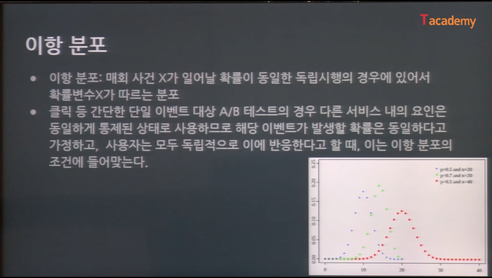

### 가설검정
통계적 추측의 하나로서, 모집단 실제의 값이 얼마나 된다는 주장과 관련해, 표본의 정보를 사용해서 가설의 합당성 여부를 판정하는 과정

가설은 두 가지...
- 통계으로 증명이 가능한 가설
- 그냥 막 찍는 문장... 이렇게 바꾸면 좋아하겠지...
  - 이런 경우는 가설이라고 만들어서 통계적 가설과 혼돈해서 사용하면 괴로움..

통계적 가설
- 특정 주장을 특정 변수(모수)에 대해서 나타낸 것을 뜻함
- 예 : 이 수업을 듣는 사람들의 평균 만 나이는 28살이다.

가설 검정 절차
- 귀무가설과 대립가설 설정, 유의수준 설정
- 검정통계량 설정
- 기각역 설정
- 검정통계량 계산
- 결과 기반 의사 결정

### A/B 테스트에서의 가설 검정

귀무가설과 대립가설
- 귀무가설(영가설) : 실험군(Pexp)의 결과와 대조군(Pcont)의 결과의 차이가 없을 것이다.
- 대립가설 : 실험군 <> 대조군 또는 실험군 > 대조군(two-sided / one-sided)

우리가 실제로 보고 싶은 것은 차이가 나는지 안 나는지 -> 대립가설을 세움
- 그냥 다르다만 볼 수도 있고, 바꾼게 낫다도 볼 수 있다.
  - 그냥 다르다 -> 작아도 되고, 커도 되고 -> two-sided
  - 작아야 한다. 커야 한다 -> one-sided

유의 수준
- 95%의 겨우(일반적으로 많이 사용)
- 0.05가 유의수준이 됨
- 통계적으로 숫자가 딱 떨어지는 경우는 드움

유의확률(P-value)
- 귀무가설이 맞을 경우에 얻은 수 있는 결과보다 더 극단적인 값이 관측될 확률
- P-value 가 작을 수록 귀무가설과 양립하는 데이터가 나타날 확률이 낮음
- P-value 가 작은 경우 귀무가설을 기각함
- P-value 의 경우 표본 크기가 커짐에 따라 값이 달라지거나 특정 경우에 값이 커지는 등의 문제가 발생할 수 있음
  - 통계적 유의성과 현실 상에서의 문제를 고려해서 결과를 판단함

P-value 의 문제?
- 요즘 들어서 데이터 수집이 쉬워지면서 문제가 많이 나타남..

### 결괏값 비교
이항 분포의 상태 비교
- 해당 집단의 크기가 np>5, n(1-p)>5 인지를 확인
- 일반적으로 정규 분포에 적용하기에 무난한 정도의 확인
- 샘플 숫자 30개?
  - 통용되기는 하지만...정의되지는 않음. 일반적으로 쓰는 정도..

큰 차이가 없다....?

비교군의 해당 지표에 대한 신뢰구간을 구한 뒤 실험군의 지표의 크기가 이 신뢰 구간에 들어가는지(유사), 벗어나는 지를 확인함
- 간단하게 독립 t-검정 등을 사용해서 유의성 및 차이 비교 가능
- R, 파이썬, Excel 등의 함수 사용(t.test 등)
- A/B test calculator 사이트들에서는 기본적으로 이를 기반으로

### Insurance Company Case

개요 
- 목적 : 광고 효과
- 가설 : 구체적이지 않은 광고문구에 사람들이 더 많이 반응할 것이다.
- A/B 테스트 : 두 가지 광고 배너에 대해서 사람들이 어떤 식의 광고에 더 많이 반응하는 지를 살펴봄
- 방식 : 동일한 광고 채널에 동일한 시간동안 임의로 두 광고를 바꿔가면서 사용자가 얼마나 더 클릭을 하는 지를 본다.

임의로 넣은 결과
- 지표 : CTR(Click-throught Rate, 클릭율)
  - # of click / # impression * 100(%)
- A CTR : 1.8%, B CTR : 7.4%
- A : 520,000 Impression, B :512,800 Impression

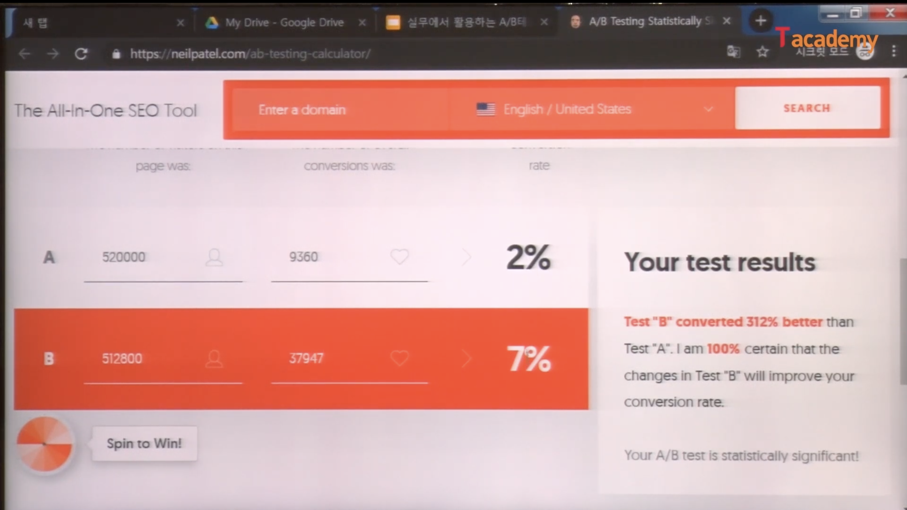

### Online Education Case

개요
- 목적 : User engagement
- 가설 : 실제로 가장 잘 팔리는 교육 프로그램을 구체적으로 확인할 수 있게 되면 사용자들의 반응도가 더 높아질 것이다.
- A/B 테스트 : 기존의 회사 교육 설명 홈페이지와 인기 교육 프로그램을 직접 나열한 홈페이지를 사용자들에게 임의로 노출
- 기간 : 20일

임의로 넣은 결과
- 지표 : Click Rate
  - # Click / # View * 100(%)
- A : 1.2%, B: 1.7%
- A : 500000 view, B : 497200 view

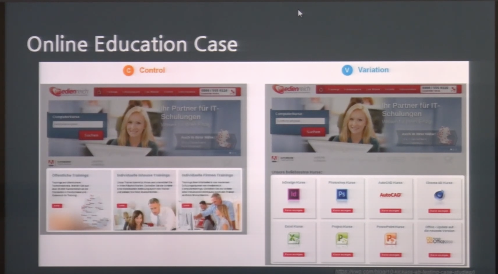

### Shopping Mall Case

개요
- 목적 : 판매량 증대
- 가설 : 구매 시점에 신뢰도 및 결제 정보 등을 사용자에게 제공하면 사용자가 더 구매를 하게 될 것이다.
- A/B 테스트 : 기존의 사이트와 신뢰 및 결제 정보를 구매 버튼 근처에 추가한 사이트를 사용자에게 임의로 제공
- 기간 : 7일

임의로 넣은 결과
- 지표 : Click User
  - 최종 목적은 구매나 실제 테스트는 구매 '버튼'에 해당하므로 click rate 가 보다 직접적인 지표임
- A : 0.8%, B: 1.0%
- A : 12100 user, B : 11900 user

테스트는 합당한가?
- 신뢰구간에 따라 다르게 나올것이다.
- 처음에 유의 수준을 어떻게 설정하느냐에 따라 결과를 사용할지, 안 할지 판단

## 4강. A/B 테스트 실험 설계 심화

A/B 테스트는 방법론이다 보니 어떤 특정 포맷에 맞춰서 쓰기는 쉽지 않다.

### 실험 설계 시 유의점

목표와 가설의 애매함
- A/B 테스트 같은 실제 환경에서의 실험에서는 실험 연구법과 같이 확정된 데이터와 연구환경이 존재하는 것이 아니라서
문제와 가설이 애매할 수 있음
- 선행 연구, 최대한 수치로 표현할 수 있는 정확한 목표 및 가설 설정, 관련 분야의 전문가의 자문 필요

데이터 수집
- 사회윤리에 반하는 자료수집의 금지
- 정확한 도구 제작의 어려움
- 사회 윤리에 반하지 않아도 사생활 관련 데이터 수집은 실험에 적절하지 않음

자료의 정리와 구조 설정
- 데이터의 집계 기준을 실험 전에 명확하게 설정해 놓아야 함
- 데이터의 사용 방식 및 수집 절차 등에 대한 명확한 정의 필요

해석설계의 문제
- 실험 전에 해석 방식 및 기준을 명확하게 마련해 두는 것이 좋음
  - 실험 전에 유의 수준 99%에 차이가 x% 차이가 나면 쓸거다 안 쓸거다 정해서 쓰는 걸로
- A/B 테스트를 반복할 수 있으면 반복하는 것이 좋으나 일반적으로는 어려움
  - 기간 떄문에 반복을 하기가 어려움 
- 데이터 수집 후 해석 방식을 부득이하게 변경해야 하는 경우 최대한 원래 실험의 목적과 지표를 해치지 않는 선에서 활용

자료의 해석문제
- A/B 테스트의 결과는 해당 시점에서의 결과일 뿐이므로 작은 숫자 등에 너무 집착하지 않는다.
- 서비스의 특성에 따른 시계열성이나 사용자 특징 등을 고려해서 결과를 해석
- 최종 결과는 서비스의 목적이나 운영 방식 등을 반영해서 사용한다.

무작위 모집을 했을 때 사용자군이....회원 100만명...
- 그 시점에 못 들어온 사용자(한 달에 2~3번 들어오는 사용자) -> 테스트 누락
- 어떻게 해야 할까요?
  - 테스트에 동일하게 반영되더라 하더라도 많이 들어오는 사용자들
  - 계속 사용하는 사람들이 계속 잘 사용하게 하는 것이 목적이라면 그냥 하면 되고...
  - 안 들어오는 사용자들이 쓰게 하고 싶다고 하면 테스트 기간을 길게 하거나, 타겟 대상을 참여할 방법을 별도로 만드는 게 좋음

서비스 실험 설계 시 사용자 대상 주의점
- 사용자에게 서비스에서 기본적으로 주어지는 것 이상의 위험을 감수하게 해야 할 가능성이 있는가?
  - 건강, 재정, 심리적, 사회적 불이익의 가능성이 있는 실험 요소는 배제되어야 함
  - 잘못하면 사용자들이 떠날수도 있음
  - 돈 이자 주는걸로 차별 테스트 하는 경우도 있다고 함
- 사용자가 해당 서비스 및 실험을 통해 어떤 데이터가 수집되고 있는 지를 이해하고 있는가?
  - 사용자 고지 의무
- 실험 사용자 데이터가 식별 가능한가?
  - 개인 식별이 아니라 서비스 내에서의 사용자 식별도 실험 윤리에 어긋날 수 있음
- 데이터는 어떤 식으로 처리되고 있는가?
  - 공개 범위 및 사용 범위 명시 및 관리

실험 후 서비스 운영시 주의점
- 실험 관련 내용은 기록으로 남겨두도록 함
- 한 번에 과하게 많은 실험은 가능한 한 피하도록 함
  - 실험 간에 영향을 미칠 수 있음
  - 데이터 기록에 문제가 생길 수 있음
  - 사용자를 모두 구분하는 경우 모수가 불충분한 경우가 발생할 수 있음
    - A, B, C, D, E....이런식으로 아예 나누어서 실험함
    - np > 5 도 안되는 경우가 발생...
- 사용성이 불안정적이 되지 않도록 유의함
- 이후 여러 데이터 분석 시에 이전 실험 내용으로 인한 영향이 미치지 않도록 함
  - 실험 사용자는 따로 목록을 만들어 둔 후 이후에도 확인할 수 있도록 함
  - 사용자에 대한 추적 분석을 통해서 이후 사용성에도 실험 내용이 영향을 미칠 수 있는 지를 확인해 두는 것도 필요
- A/B 테스트를 자주 할 경우 관련 API 등을 구성해 두는 것도 필요

### 다변량 테스트
다변량 테스트와 다변량 분석은 다른 것 - 찾아서 보세요

웹페이지의 여러 부분을 바꾸고 싶은 욕심이 생김
- 한 번에 테스트를 하고 싶음
- 그런데 보기가 6개나 나옴
- 6개 중에서 사용자의 반응성을 확인
- 근데 제일 많이 나온거와 두 번째로 많이 나온거의 차이를 비교해 보고 사용 결정

사용자가 많이 쪼개져서....

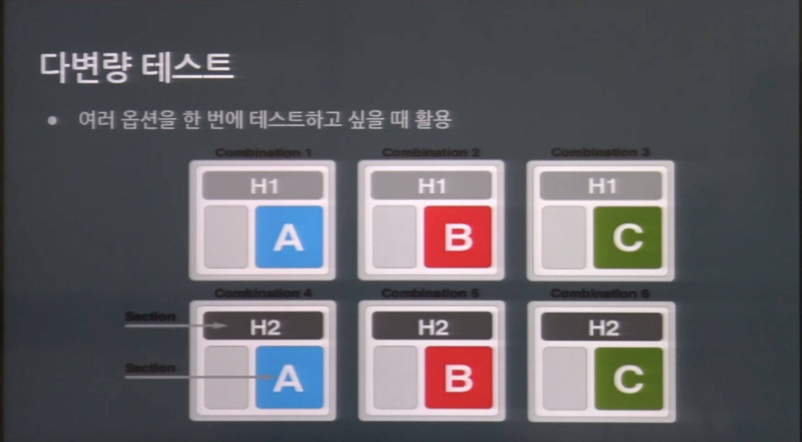

### MAB 알고리즘

강화학습의 하나로, 결과를 보면서 집단을 선택적으로 조절하는 알고리즘
- Exploration-Exploitation trade off 문제를 위해 성과와 테스트 효과 모두를 최적으로 가져올 수 있게 하는 방법론 및 알고리즘을 총칭함
- A/B 테스트에서의 집단의 크기를 지속적으로 조율함

 
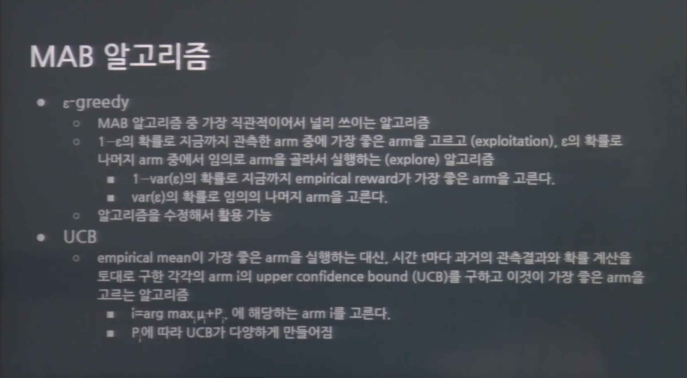

