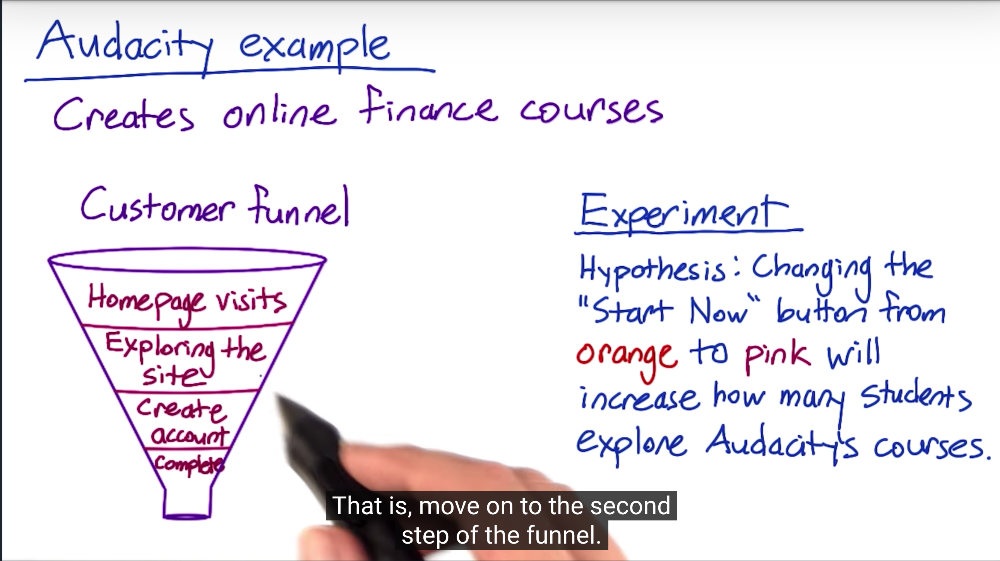
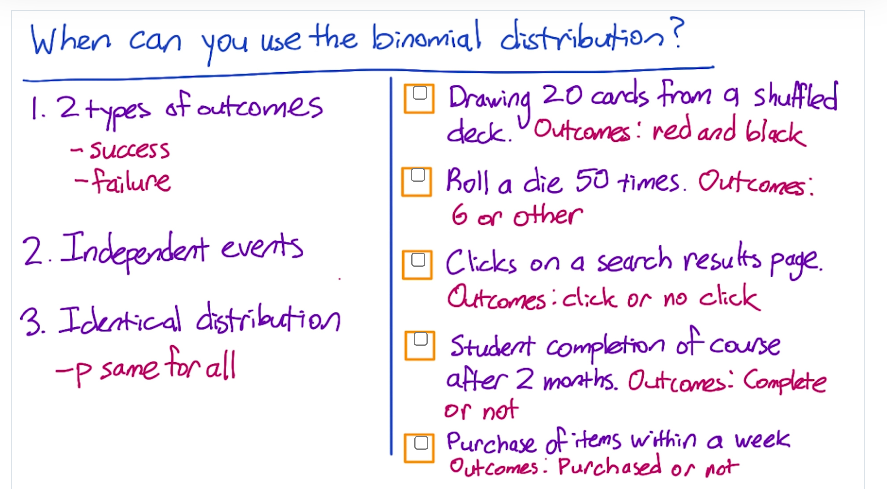
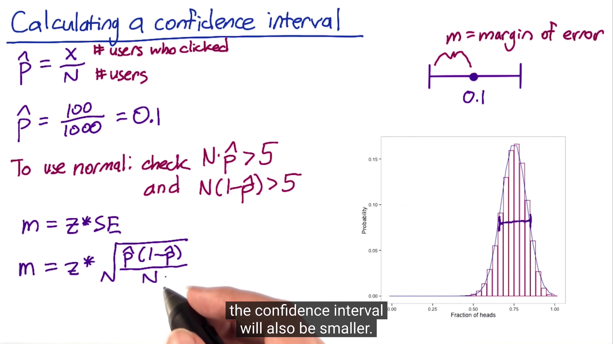
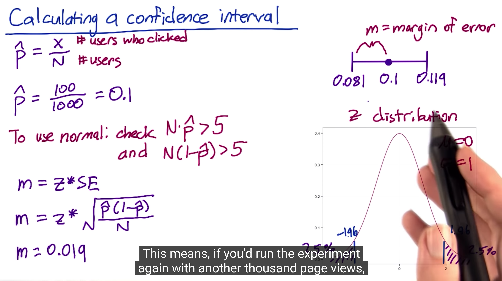
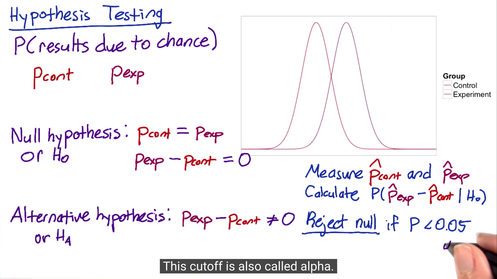
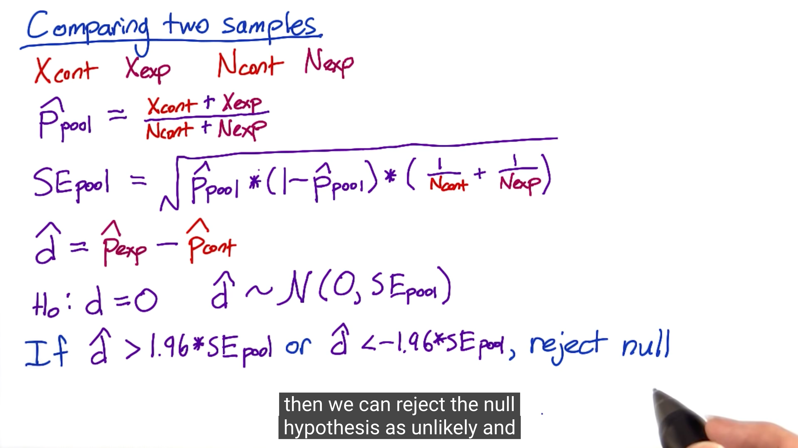
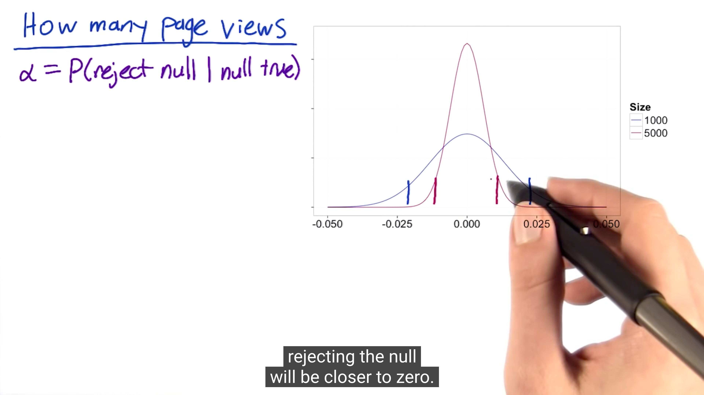
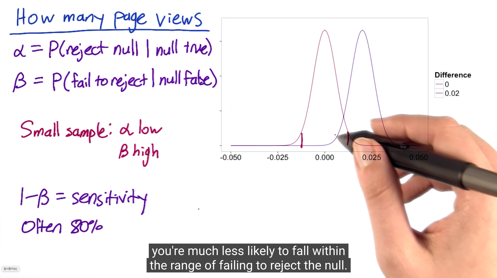

UdaCity A/B Test
----

유다시티에서 수강한 ab 테스트 중 일부 내용을 기록

## Lesson 1
코스 전반에 대한 이야기를 소개 하고 있다.
- AB 테스트가 무엇인지, 어떻게 하는 것인지, 어떤 내용들이 있는지 등에 대해 이야기 하고 있음
- AB 테스트의 목적은 결국 좋은 의사 결정을 하기 위해서이다.
- 여러 회사에서 하고 있으며 각각의 목적은 다 다르다. 사이트 최적화 일수도 있고 더 나은 서비스를 제공하기 위한 경우도 있다.

페이지 최적화 과정에서의 CTR

이항 분포는 이해하기 쉬운 좋은 예시이다.
- 클릭 여부의 관점에서 보았을 때 클릭 성공/실패 두 가지만 있기 때문

Confidence Intervals

Null and Hypothesis Testing
- P control vs P experiment Group
- 영가설을 세우고 대립가설을 세운다음 통계적으로 검증한다.

size vs Power 는 Trade-off 관계

